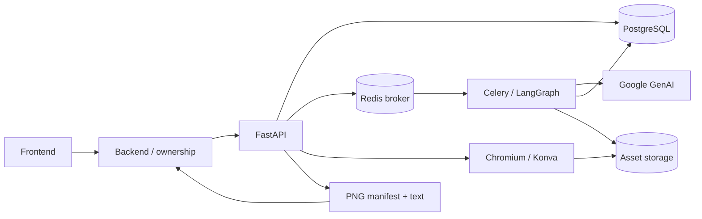

<p align="center">
  
</p>

<p align="center">
  <a href="https://www.python.org/"></a>
  <a href="https://docs.astral.sh/uv/"></a>
  <a href="https://fastapi.tiangolo.com/"></a>
  <a href="https://github.com/langchain-ai/langgraph"></a>
</p>
<p align="center">English | <a href="i18n/README-KR.md">한국어</a></p>
<p align="center">Collect product details through conversation,<br>then generate crowdfunding page images and supporting text.</p>

---

Funding Story AI is Fundit's internal AI API. It reads registered product information, asks for missing details, and presents a summary and product strengths for user confirmation. An asynchronous generation job fills a design template with copy and images. The final output is ordered PNG assets and project information text.

This repository contains the AI service, worker, template resources, tests, and integration contracts. Frontend screens, project ownership, permanent project content, and publishing belong to the frontend/backend services.

[Features](#what-does-funding-story-ai-do) · [Quick Start](#-quick-start) · [Architecture](#-architecture) · [Output](#what-you-get) · [Documentation](#learn-more)

## What does Funding Story AI do?

### Conversational intake

- Starts from registered product facts, rewards, and reference images.
- Streams conversational replies through SSE and asks for missing context.
- Lets users revise, reorder, or remove product strengths through conversation.
- Requires confirmation of the current input revision before generation.
- Preserves supplied prices, units, specifications, and conditions; missing facts are not invented.

### Template-based generation

- Includes nine required appliance-template blocks in a fixed order.
- Selects Point layouts for confirmed strengths and optionally includes an Information block.
- Generates copy and images for declared slots, with failed slots available for retry.
- Measures copy with Konva; slot-format failures feed into the existing bounded LangGraph retry.
- Uses no additional model-based factuality judge or automatic factual correction pass.

### PNG and text export

- Renders PNGs with server-side Chromium, Konva 10.5.0, and Pretendard.
- Keeps template font sizes; linked text follows explicit layout rules.
- Returns budget, schedule, team, policy, and risks separately as text. Gift detail descriptions are excluded.
- Clears temporary design data after the backend confirms permanent content storage.
- Does not offer design re-editing of saved PNGs or a frontend editor in this repository.

## 🚀 Quick Start

### 1. Install

Requires Python 3.12.14, [uv](https://docs.astral.sh/uv/), Docker Compose, and Google Cloud credentials for live model calls. Run from this repository's root:

```bash
uv sync --frozen
cp .env.example .env
uv run playwright install chromium
uv run python scripts/install_font.py
```

On Linux, use `uv run playwright install --with-deps chromium`. The font installer verifies the pinned checksum; font files stay under ignored `data/`.

### 2. Configure and start dependencies

Set `GOOGLE_CLOUD_PROJECT` and an internal `AI_SERVICE_TOKEN` in `.env`. For local Google credentials, use `gcloud auth application-default login` if ADC is not already configured. Live model calls incur provider charges.

```bash
docker compose up -d
uv run python -m funding_story.store
```

The compose file starts local PostgreSQL and Redis only. Full settings are in [`.env.example`](.env.example).

### 3. Start API, worker, and scheduler

Run each command in a separate terminal:

```bash
uv run uvicorn funding_story.api:app --host 127.0.0.1 --port 58001
uv run celery -A funding_story.tasks worker --pool=solo --loglevel=INFO
uv run celery -A funding_story.tasks beat --loglevel=INFO --schedule=data/celerybeat-schedule
```

`solo` is the macOS development worker configuration. API and worker must share configuration and storage. Local API docs: [Swagger UI](http://127.0.0.1:58001/docs). Detailed setup and Docker usage: [Development guide](docs/development.md).

### 4. Connect a caller

Calls follow **FE → BE → AI**. The backend verifies ownership and sends `Authorization: Bearer <internal-token>` plus `X-Project-Id`. Do not expose this token to the browser.

The call sequence is upload → session → start/chat → confirm revision → run → poll/retry → export → backend save → export commit. See [API contracts](docs/architecture.md), [OpenAPI](docs/openapi.json), and [frontend mapping](docs/frontend-call-contract.md).

## 🏗 Architecture



Python 3.12 / uv / FastAPI / LangGraph / Celery / PostgreSQL / Redis / Google GenAI SDK / optional LangSmith tracing. Redis transports jobs; PostgreSQL stores durable state and checkpoints. Asset storage supports local files or S3. Package versions are locked in `uv.lock`.

## What you get

- Ordered PNG asset IDs with block IDs, dimensions, and alternative text.
- Project information text and a fixed crowdfunding-notice key.
- `project_summary.summary` and `storyline` for downstream use.
- Export ID and source revision for backend storage confirmation.

See the [example response](docs/examples/export-result.json). Supplied reward prices remain unchanged. Unregistered cards in the fixed three-card reward design remain `input_required`; they are not fabricated.

## Validation and scope

```bash
uv run ruff check src tests scripts
uv run pytest -q
uv build
```

Tests use a separate PostgreSQL database and mocked model calls; rendering tests run real Chromium. The [synthetic fixture](tests/fixtures/appliance.json) and [reference image](tests/fixtures/original.png) are test material, not commercial product claims.

Local validation includes 37 tests and an actual 14-block generation/export case. Generated product details can still differ from reference images. GitHub CI has passed. Production deployment and cross-team publishing integration are not claimed complete. See [validation scope](docs/validation.md).

## Learn more

- [API and execution contracts](docs/architecture.md)
- [Development and configuration](docs/development.md)
- [Frontend call mapping](docs/frontend-call-contract.md)
- [Team handoff](docs/team-handoff.md)
- [Validation scope](docs/validation.md)
- [Third-party notices](THIRD_PARTY_NOTICES.md)
