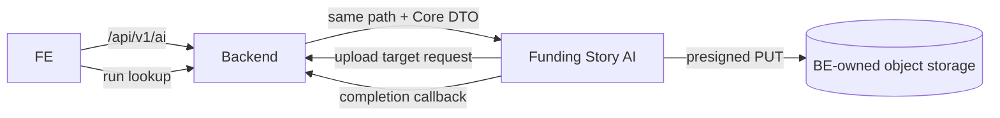

<p align="center">
  
</p>

<p align="center">
  <a href="https://www.python.org/"></a>
  <a href="https://docs.astral.sh/uv/"></a>
  <a href="https://fastapi.tiangolo.com/"></a>
  <a href="https://github.com/langchain-ai/langgraph"></a>
</p>
<p align="center">English | <a href="i18n/README-KR.md">한국어</a></p>

# Fundit Funding Story AI

Internal AI service for conversational Funding Story intake and full-page generation.
The integration boundary is **FE → BE → AI**: FE never calls this service directly, and AI
never reads or writes the BE Core database.

## Funding Story capabilities

### Conversational intake

- Starts from registered project facts, rewards, and reference images.
- Streams questions and summaries through SSE while collecting missing Story context.
- Lets users revise, reorder, or remove strengths through conversation.
- Requires confirmation of the current revision before a full generation run.
- Preserves supplied prices, units, specifications, and conditions; missing facts are not invented.

### Template generation

- Produces copy and images for the configured Funding Story template blocks.
- Generates image slots and renders PNG blocks with bounded concurrency, preserving template order.
- Uses confirmed strengths and optional product information without fabricating unsupported content.
- Retries failed image or rendering slots internally and reports usable partial results when needed.

### Rendering and delivery

- Renders PNG output with server-side Chromium, Konva, and Pretendard.
- Uploads generated images to BE-owned storage using short-lived upload targets.
- Appends escaped lower-page HTML from confirmed chat facts after the PNG references when those facts are available.
- Delivers generated body content, image references, and terminal status to BE through one completion callback.

## Contract at a glance

| Boundary | Contract |
|---|---|
| BE → AI | `Authorization: Bearer <service-token>` + `X-Project-Id` |
| Public service base path | `/api/v1/ai` (the same path is used by FE→BE and BE→AI) |
| AI → BE | `X-Internal-Api-Key` + `X-Project-Id` |
| Final images | AI requests presigned PUT targets from BE and uploads to BE-owned object storage |
| Final result | AI sends one completion callback; BE validates and owns the public result |
| Regeneration | Full regeneration only; no block/slot partial-regeneration API |

Funding Story endpoints:

| Method | Path | Purpose |
|---|---|---|
| `POST` | `/api/v1/ai/sessions` | Create a TTL intake session from BE Core facts |
| `GET` | `/api/v1/ai/sessions/latest` | Recover the latest valid TTL session |
| `GET` | `/api/v1/ai/sessions/{session_id}` | Read public session state |
| `POST` | `/api/v1/ai/sessions/{session_id}/start` | Queue the assistant-led first turn |
| `POST` | `/api/v1/ai/sessions/{session_id}/messages` | Queue one idempotent user message |
| `GET` | `/api/v1/ai/chats/{chat_id}/events` | Stream the answer and terminal chat event |
| `POST` | `/api/v1/ai/sessions/{session_id}/confirm` | Confirm the current summary revision |
| `POST` | `/api/v1/ai/runs` | Queue a full generation run |

AI calls these BE-internal endpoints after generation:

| Method | Path | Purpose |
|---|---|---|
| `POST` | `/internal/ai/media/upload-targets` | Obtain one presigned PUT target per output slot |
| `POST` | `/internal/ai/runs/{run_id}/completion` | Deliver `succeeded`, `partially_succeeded`, or `failed` |

There is intentionally no AI `GET /runs/{run_id}`, asset API, export API, export ID, or
partial-regeneration endpoint. Public run lookup belongs to BE.

## Data ownership



- Funding Story sessions, chats, run control state, revisions, and idempotency are PostgreSQL TTL data.
- Project facts, source images, final PNGs, generated public content, and final run state are BE-owned.
- Source images and generated PNGs are held in AI process memory only while a job is running.
- Funding Story does not persist input snapshots, generated documents, intermediate images, or
  LangGraph checkpoints in PostgreSQL.
- Funding Story control state and Content Insights reuse the same AI PostgreSQL logical database.
- Logs contain operational metadata only; prompts, user text, Core DTOs, signed URLs, and generated
  bodies are not written to logs or tracing systems.

## Generation rules

- BE Core DTO is the only source for project facts, rewards, prices, quantities, and source images.
- `price` is the only displayed reward price. `normal_price` and discount expressions are excluded.
- Reward `quantity` means available stock; it is never used as the number of products shown.
- Information collection ends with a chat summary of product, story, and strengths.
- Image generation retries internally. If usable outputs remain after a final slot failure, AI sends
  `partially_succeeded`; otherwise it sends `failed`.

## Content Insights

Content Insights is separate from the optional Funding Story authoring flow. After a project
snapshot is saved, Project Service requests two independent artifacts from this service:

- `PAGE_SUMMARY`: a short summary for the project detail page.
- `STORYLINE`: two ordered headline/detail blocks that summarize what the project is and why it matters (schema v2; internal semantic roles stay hidden).

Both artifacts are required for the project readiness policy. Project Service owns the canonical
public result and the FE reads it from Project Service; FE does not call these AI endpoints directly.
The current internal endpoints use the same service base path:

| Method | Path | Purpose |
|---|---|---|
| `POST` | `/api/v1/ai/content-insight-runs` | Create a snapshot-based parent run |
| `GET` | `/api/v1/ai/content-insight-runs/{run_id}` | Read artifact status and results |
| `POST` | `/api/v1/ai/content-insight-runs/{run_id}/artifacts/{artifact_type}/retry` | Retry one retryable artifact |

Content Insights keeps its own PostgreSQL-backed artifact state, queues, revision checks, and
retry lifecycle. It does not use the Funding Story TTL session state.

## Local development

Requires Python 3.12.14, [uv](https://docs.astral.sh/uv/), Docker, and Google Cloud credentials for
text calls. `.env.example` uses `local_google_experiment` with `gemini-3.1-flash-image`;
dev/prod uses `MODEL_PROFILE=runtime` with `gpt-image-2.5-flare` and EKS WIF. Local OpenAI
verification uses `MODEL_PROFILE=local_openai_smoke` with the same OpenAI model alias and an API key.

```bash
uv sync --frozen
cp .env.example .env
uv run playwright install chromium
uv run python scripts/install_font.py
docker compose up -d
docker compose run --rm migrate validate
```

Run the API and PostgreSQL polling worker in separate terminals:

```bash
uv run uvicorn funding_story.api:app --host 127.0.0.1 --port 58001
uv run python -m funding_story.worker --lane all
```

Local Swagger UI: [http://127.0.0.1:58001/docs](http://127.0.0.1:58001/docs)

## Validation

```bash
uv run ruff check src tests scripts
uv run pytest -q
uv build
```

Funding Story application and HTTP contract tests use the in-memory TTL adapter. Database tests use
an isolated PostgreSQL 17 container for state TTL, job leases, shared image pacing, Content Insights,
and migration validation. Rendering tests use real Chromium and Pretendard.

## Documentation

- [API and execution contract](docs/architecture.md)
- [OpenAPI](docs/openapi.json)
- [Development and configuration](docs/development.md)
- [Content Insights API design](docs/content-insights-api-design.md)
- [Content Insights integration](docs/content-insights-integration-interface.md)
- [Content Insights operations](docs/content-insights-operations.md)
- [Content Insights implementation checklist](docs/content-insights-implementation-checklist.md)
- [Frontend call contract](docs/frontend-call-contract.md)
- [Team handoff](docs/team-handoff.md)
- [Validation scope](docs/validation.md)
- [Third-party notices](THIRD_PARTY_NOTICES.md)
