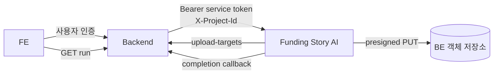
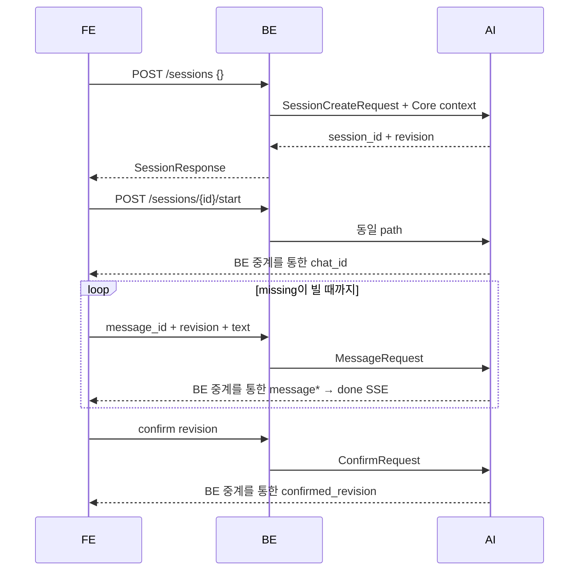
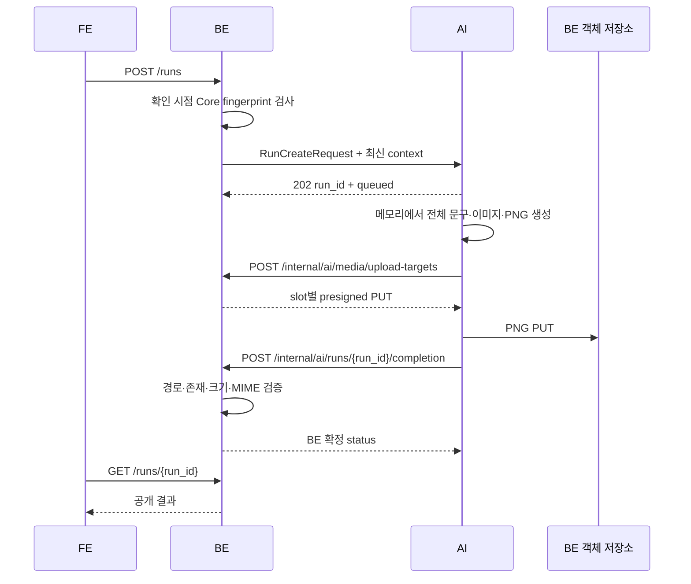
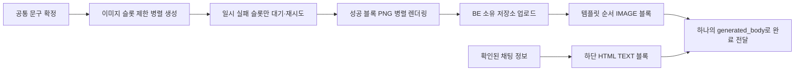

# Funding Story AI 실행·API 계약

| 항목 | 값 |
|---|---|
| 공개 base path | `/api/v1/ai` |
| 호출 흐름 | FE → BE → AI |
| 생성 범위 | 전체 재생성만 지원 |
| AI 상태 저장 | PostgreSQL TTL |
| 최종 결과 소유 | BE |

## 1. 경계



| 데이터 | 소유·보관 |
|---|---|
| 프로젝트·리워드 사실 | BE Core DB |
| 원본·최종 이미지 | BE 소유 객체 저장소 |
| 세션·채팅·run 제어 상태 | AI PostgreSQL TTL |
| 최종 본문·상태·검증 URL | BE |
| Content Insights artifact | AI PostgreSQL — Funding Story와 별도 기능 |

AI는 BE Core DB를 읽거나 쓰지 않는다. Funding Story는 입력 snapshot, 생성 문서, 중간 이미지,
최종 이미지, 장기 LangGraph checkpoint를 AI DB에 저장하지 않는다.

## 2. BE → AI API

공통 헤더:

```http
Authorization: Bearer <service-token>
X-Project-Id: <project-public-id>
Content-Type: application/json
```

| Method | Path | Request | Success |
|---|---|---|---|
| `POST` | `/api/v1/ai/sessions` | `SessionCreateRequest` | `201 SessionResponse` |
| `GET` | `/api/v1/ai/sessions/latest` | - | `200 LatestSessionResponse` |
| `GET` | `/api/v1/ai/sessions/{session_id}` | - | `200 SessionResponse` |
| `POST` | `/api/v1/ai/sessions/{session_id}/start` | - | `202 ChatAcceptedResponse` |
| `POST` | `/api/v1/ai/sessions/{session_id}/messages` | `MessageRequest` | `202 ChatAcceptedResponse` |
| `GET` | `/api/v1/ai/chats/{chat_id}/events` | - | `200 text/event-stream` |
| `POST` | `/api/v1/ai/sessions/{session_id}/confirm` | `ConfirmRequest` | `200 ConfirmResponse` |
| `POST` | `/api/v1/ai/runs` | `RunCreateRequest` | `202 RunAcceptedResponse` |

`GET /api/v1/ai/runs/{run_id}`는 BE 공개 조회 API이며 AI로 전달하지 않는다.

## 3. 입력·대화



| DTO | 핵심 필드 |
|---|---|
| `FundingStoryContext` | `project`, `rewards[1..3]`, `source_images[0..30]` |
| `ProjectFact` | `business_type`, `category.major/minor`, `title`, `goal_amount` |
| `RewardFact` | `reward_id`, `name`, `description`, `price`, `is_limited`, `quantity`, `is_early_bird`, `options` |
| `SourceImageRef` | `slot_id`, `reward_id`, `read_url`, `content_type`, `file_size`, `expires_at` |
| `MessageRequest` | `message_id`, `revision`, `text` |
| `SessionResponse` | `session_id`, `revision`, `confirmed_revision`, `messages`, `missing`, `summary`, `active_chat_id` |

`quantity`는 재고 수량이며 완제품 표시 개수가 아니다. `price`만 사용하고 `normal_price`, 할인율,
`product_count`, `product_description`, 자유 형식 `information`, AI `asset_id`는 받지 않는다.

| 추가 본문 정보 | 내부 처리 |
|---|---|
| 예산·일정·팀·프로젝트 정책·예상 어려움 | 채팅 → TTL `Review.story_context` → 답변 요약에 표시 → revision 확인 → HTML |
| 미제공 선택 정보 | 빈 항목 생략; 금액·날짜·정책 추정 및 생성 차단 없음 |
| 리워드 사실·가격·옵션 | 채팅·템플릿에 BE Core 사실 사용; 하단 HTML에 리워드별 상세를 추가하지 않음 |
| 공통 크라우드 펀딩 안내 | 서비스 고정 콘텐츠; AI 생성 대상 아님 |

## 4. 전체 생성·완료



AI → BE 공통 헤더:

```http
X-Internal-Api-Key: <internal-key>
X-Project-Id: <project-public-id>
Content-Type: application/json
```

| Method | Path | Request | Success |
|---|---|---|---|
| `POST` | `/internal/ai/media/upload-targets` | `OutputDescriptor[]` | `200 UploadTarget[]` |
| `POST` | `/internal/ai/runs/{run_id}/completion` | `RunCompletionRequest` | `200 RunCompletionResponse` |

| 완료 상태 | 조건 |
|---|---|
| `succeeded` | 사용 가능한 이미지가 있고 최종 실패 슬롯 없음 |
| `partially_succeeded` | 내부 재시도 후 실패 슬롯이 남지만 사용 가능한 결과 존재 |
| `failed` | 사용할 수 있는 결과 없음 |

부분 성공 결과도 AI가 BE에 전달한다. BE가 객체를 검증한 뒤 상태를 유지하거나 낮추며, FE 공개
응답의 `partially_succeeded` 표시·처리는 BE와 FE 계약에서 담당한다.

### 본문 구성



| `generated_body.intro_content` | 값·순서 |
|---|---|
| `IMAGE` | 업로드 성공한 PNG의 `slot_id`; 템플릿 순서 유지 |
| 선택적 마지막 `TEXT` | 확인된 항목만 예산 → 일정 → 팀 → 신뢰와 안전(정책·어려움) 순서로 HTML 구성; 모두 비어 있으면 생략 |
| 생성 HTML 태그 | `p`, `strong`, `br`; 입력 값 전체 escape, 링크·스크립트·style 없음 |

```json
{"cover_image_slot_id":"hero","intro_content":[{"type":"IMAGE","slot_id":"hero"},{"type":"TEXT","value":"<p><strong>프로젝트 예산</strong></p><p>금형 제작에 사용합니다.</p>"}]}
```

전송은 기존 `IMAGE/TEXT` DTO를 유지한다. 단일 `html` 필드를 추가하거나 ``를 `TEXT`에 넣지 않는다.
BE가 검증한 이미지 URL과 HTML을 하나의 본문으로 표시·편집하는 처리는 FE 연동 대상이다.
공통 크라우드 펀딩 안내와 리워드 접기 UI는 AI가 임의의 정책·지원되지 않는 HTML 태그로 생성하지 않는다.

## 5. 멱등·동시성

| 값 | 규칙 |
|---|---|
| `message_id` | 같은 ID·같은 입력은 기존 chat, 다른 입력은 `409` |
| `revision` | 현재 revision 메시지만 접수, chat 성공 후 증가 |
| `confirmed_revision` | 현재 요약 확인 revision, 새 대화 성공 시 해제 |
| `idempotency_key` | 같은 키·같은 run 입력은 기존 run, 다른 입력은 `409` |
| 활성 run | 같은 세션에 한 개만 허용해 비저장 입력 snapshot의 교체를 방지 |

전체 재생성은 새 `idempotency_key`로 `POST /runs`를 다시 호출한다. `/runs/{run_id}/retry`,
`target_block_id`, 슬롯 재생성 경로는 없다.

## 6. 오류

모든 동기 오류는 아래 형태다.

```json
{
  "code": "CONFLICT",
  "message": "전체 생성 작업을 처리 중입니다.",
  "detail": null
}
```

| HTTP | code |
|---:|---|
| 400 | `INVALID_INPUT` |
| 401 | `UNAUTHORIZED` |
| 403 | `FORBIDDEN` |
| 404 | `NOT_FOUND` |
| 409 | `CONFLICT` |
| 422 | `NOT_READY_TO_GENERATE` 또는 `INVALID_PROJECT_DATA` |
| 429 | `TOO_MANY_REQUESTS` |
| 503 | `DEPENDENCY_FAILURE` |

접수 후 실패는 HTTP 오류 조회가 아니라 BE 공개 run 응답의 terminal status로 표현한다.

## 7. Content Insights — 별도 기능

Content Insights는 Funding Story 세션·전체 생성과 분리된 프로젝트 콘텐츠 요약 기능이다.
Project Service가 저장한 정규 snapshot과 source revision을 기준으로 `PAGE_SUMMARY`와
`STORYLINE` artifact를 독립 생성한다. `PAGE_SUMMARY`는 상세 페이지용 짧은 요약이고,
`STORYLINE`은 schema v2의 두 개의 What·Why 제목·설명 블록이다. 내부 의미 구분명은 FE에
직접 노출하지 않는다.

| Method | Path | 역할 |
|---|---|---|
| `POST` | `/api/v1/ai/content-insight-runs` | snapshot 기반 parent run 생성 |
| `GET` | `/api/v1/ai/content-insight-runs/{run_id}` | parent·artifact 상태 및 결과 조회 |
| `POST` | `/api/v1/ai/content-insight-runs/{run_id}/artifacts/{artifact_type}/retry` | retryable artifact 단건 재시도 |

각 artifact는 독립 상태·queue·prompt/schema version·오류·시도 횟수를 가지며, 더 최신
source revision이 생기면 이전 결과는 공개 기준에서 제외한다. 두 required artifact가 모두
성공해야 Project Service의 `required_artifacts_ready`가 충족된다. 공개 FE 응답은 AI 내부
상태를 그대로 노출하지 않고 Project Service가 저장한 canonical 결과를 사용한다.

상세 입력·응답과 운영 절차는 [Content Insights API 설계](content-insights-api-design.md),
[통합 인터페이스](content-insights-integration-interface.md), [운영 안내](content-insights-operations.md)를
따른다.
