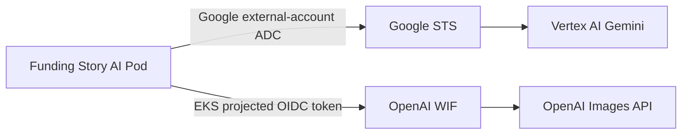

# AWS EKS Provider 인증 계약

## 구성



| 기능 | Provider | 운영 인증 | 로컬 실호출 |
|---|---|---|---|
| 채팅·문구·Content Insights | Vertex AI Gemini | EKS OIDC → GCP Workload Identity Federation → ADC | `gcloud auth application-default login` |
| 이미지 | OpenAI | `MODEL_PROFILE=runtime` + EKS projected token → OpenAI WIF | `MODEL_PROFILE=local_openai_smoke` + API key |

## 런타임 계약

| 값 | 소유 | 주입 방식 |
|---|---|---|
| `MODEL_PROFILE` | AI | dev/prod에서 `runtime` 고정 |
| `GOOGLE_CLOUD_PROJECT`, `GOOGLE_CLOUD_LOCATION` | AI·인프라 합의 | ConfigMap |
| `GOOGLE_APPLICATION_CREDENTIALS` | 인프라 | GCP external-account JSON mount 경로 |
| Google subject token | EKS | audience가 GCP provider와 일치하는 projected volume |
| `OPENAI_IDENTITY_PROVIDER_ID` | OpenAI 조직 관리자 | ConfigMap 또는 조직 정책에 따른 Secret |
| `OPENAI_SERVICE_ACCOUNT_ID` | OpenAI 조직 관리자 | ConfigMap 또는 조직 정책에 따른 Secret |
| `OPENAI_WIF_AUDIENCE` | AI·인프라 합의 | `https://api.openai.com/v1` |
| `OPENAI_WIF_TOKEN_FILE` | GitOps | `/var/run/secrets/openai-wif/token` |
| OpenAI subject token | EKS | audience가 OpenAI 설정과 일치하는 projected volume |

두 projected token은 같은 Kubernetes ServiceAccount가 발급받아도 audience와 mount 경로를 분리한다. 실제 값은 Git에 저장하지 않는다.

## OpenAI WIF

| 순서 | 인프라·관리자 작업 | 확인값 |
|---:|---|---|
| 1 | AI 전용 Kubernetes ServiceAccount 생성 | `system:serviceaccount:<namespace>:funding-story-ai` |
| 2 | EKS cluster OIDC issuer 조회 | token `iss`와 동일 |
| 3 | audience `https://api.openai.com/v1` projected token mount | token `aud`와 동일 |
| 4 | OpenAI Platform에 EKS issuer 기반 provider 생성 | `OPENAI_IDENTITY_PROVIDER_ID` |
| 5 | 정확한 ServiceAccount `sub`를 OpenAI project service account에 매핑 | `OPENAI_SERVICE_ACCOUNT_ID` |
| 6 | mapping 권한을 최소 `api.model.request`로 제한 | 이미지 API 호출 가능 |

참고: [OpenAI AWS WIF](https://developers.openai.com/api/docs/guides/workload-identity-federation/aws)

## Gemini ADC

| 순서 | 인프라 작업 | 결과 |
|---:|---|---|
| 1 | GCP Workload Identity Pool provider가 EKS issuer를 신뢰하도록 구성 | EKS OIDC 검증 |
| 2 | `sub`를 AI 전용 ServiceAccount로 제한 | namespace·workload 격리 |
| 3 | 대상 GCP service account에 Vertex AI 최소 권한 부여 | Gemini 호출 권한 |
| 4 | projected token file을 참조하는 `external_account` JSON 생성 | 장기 private key 없음 |
| 5 | JSON과 subject token을 read-only mount | ADC 자동 로드 |

external-account 설정에는 다음 구조가 필요하다. placeholder는 인프라 환경값으로 교체한다.

```json
{
  "type": "external_account",
  "audience": "//iam.googleapis.com/projects/<number>/locations/global/workloadIdentityPools/<pool>/providers/<provider>",
  "subject_token_type": "urn:ietf:params:oauth:token-type:jwt",
  "token_url": "https://sts.googleapis.com/v1/token",
  "service_account_impersonation_url": "https://iamcredentials.googleapis.com/v1/projects/-/serviceAccounts/<service-account>:generateAccessToken",
  "credential_source": {
    "file": "/var/run/secrets/google-identity/token"
  }
}
```

## GitOps 예시·검증

적용용 원본은 Fundit-GitOps가 관리한다. AI 저장소 예시는 [`deploy/examples/eks-provider-auth.yaml`](../deploy/examples/eks-provider-auth.yaml)이다.

```sh
# Pod 내부: token 원문·credential 본문을 출력하지 않는 오프라인 검사
/app/.venv/bin/python -m funding_story.auth_check
```

| 검사 | 보장 | 보장하지 않음 |
|---|---|---|
| OpenAI token | JWT 구조·issuer·audience·subject·만료 | 서명·OpenAI mapping·실 API 권한 |
| Google ADC | `external_account` 형식·subject token file·private key 미사용 | GCP STS exchange·Vertex IAM 권한 |

최종 통합 검증은 dev EKS에서 OpenAI 단일 이미지 호출과 Gemini 단일 구조화 응답 호출로 수행한다.

## 금지

| 금지 항목 | 대안 |
|---|---|
| OpenAI API key를 dev/prod Secret에 저장 | OpenAI WIF |
| GCP service-account JSON private key 저장 | GCP external-account ADC |
| token 원문 로그·디코드 결과 외부 업로드 | `auth_check`의 제한된 metadata만 사용 |
| 공용 namespace ServiceAccount 매핑 | AI workload 전용 ServiceAccount와 정확한 `sub` |
