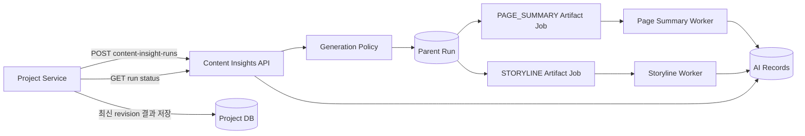

# 필수 프로젝트 콘텐츠 생성 API 설계

최초 작성: 2026-09-17
정책 반영: 2026-09-18
상태: AI API 0.3.0 구현 기준. 제품 정책과 통합 인터페이스 확정, Backend·FE 적용은 별도 저장소 작업

관련 작업 체크리스트: [Content Insights 구현 체크리스트](content-insights-implementation-checklist.md)
통합 경계: [Content Insights 통합 인터페이스 계약](content-insights-integration-interface.md)

## 1. 배경

현재 Funding Story AI의 생성 결과인 `CopyResult`에는 상세 페이지 원고와 함께 `summary`, `storyline`이 포함된다. 이 구조에서는 사용자가 선택 기능인 Funding Story AI를 실행해야만 페이지 요약과 스토리라인을 얻을 수 있다.

펀딩 상세 페이지 요약과 스토리라인은 프로젝트 등록 과정에서 반드시 생성되어야 하며 선택적 Funding Story 생성 흐름에 종속되어서는 안 된다.

따라서 다음과 같이 경계를 변경한다.

- 선택 기능인 Funding Story 작성·이미지 생성과 필수 프로젝트 콘텐츠 생성을 분리한다.
- 저장소는 `Fundit-AI-Funding-Story` 하나를 유지한다.
- 외부 생성 진입점은 하나로 제공한다.
- 내부에서는 페이지 요약과 스토리라인을 독립 artifact로 실행·저장·재시도한다.
- 향후 스토리라인 실행 시점이 다시 변경되더라도 외부 계약을 깨지 않고 정책 또는 개별 API로 분리할 수 있어야 한다.

## 2. 결정 사항

### 확정

1. `PAGE_SUMMARY`는 프로젝트 등록 콘텐츠가 완료된 시점에 생성한다.
2. `PAGE_SUMMARY`는 선택적 Funding Story 세션·확인·run·export에 의존하지 않는다.
3. `PAGE_SUMMARY`와 `STORYLINE`은 하나의 Content Insights API를 통해 요청한다.
4. 두 artifact는 별도 상태, 프롬프트 버전, 실패, 재시도, 작업 큐를 가진다.
5. 프로젝트 서비스가 보유한 정규 프로젝트 snapshot과 revision을 생성 입력의 기준으로 사용한다.
6. 기존 Funding Story export의 `project_summary`는 필수 결과의 기준 데이터가 아니다.
7. `STORYLINE`도 프로젝트 등록 완료와 콘텐츠 수정 시 생성하며 필수 결과로 판정한다.
8. Storyline은 고정 순서의 두 요약 블록이며 각 블록은 헤드라인 한 줄과 상세 설명 한 줄을 가진다.
9. 두 블록의 내부 의미는 리워드 정체성과 프로젝트 필요성이지만 해당 역할명은 사용자 문구로 노출하지 않는다.

### 운영에서 확정할 항목

1. 필수 결과의 AI 저장소 보존 기간과 백엔드 영구 저장 완료 후 정리 정책.
2. worker replica·concurrency·CPU·메모리의 환경별 값.
3. queue 지연·실패율·장기 실행 경보의 최종 임계값.
4. 실제 모델 샘플 평가 실행과 운영 승인.

운영값은 API 요청·응답 구조에 하드코딩하지 않고 배포 설정과 운영 정책으로 관리한다.

### 0.3.0 초기 정책

- `PROJECT_REGISTRATION_COMPLETED`, `PROJECT_CONTENT_UPDATED`: `PAGE_SUMMARY`와 `STORYLINE`을 모두 requested/required로 강제한다. 호출자가 요청 목록에서 하나를 누락해도 policy가 두 artifact를 추가한다.
- `STORY_CONFIRMED`: 향후 분리 가능성을 검증하는 정책 경계로 제공하며 `STORYLINE`만 requested/required다. 실제 호출 시점은 아직 제품 계약이 아니다.
- 적용된 정책과 `content-insights-policy-v2`는 parent run에 저장한다. 이후 기본 정책이 바뀌어도 기존 run의 판정 근거는 유지한다.

## 3. 목표와 비목표

### 목표

- Funding Story AI를 사용하지 않아도 필수 페이지 요약을 생성한다.
- 페이지 요약과 필수 스토리라인을 등록 시 한 번의 요청으로 시작한다.
- 한 artifact의 실패가 다른 artifact의 성공 결과를 취소하지 않는다.
- artifact별 재시도와 관측이 가능하다.
- 스토리라인 실행 시점이 바뀌어도 BE 연동 계약을 가능한 한 유지한다.
- 선택적 이미지 생성 부하가 필수 페이지 요약을 지연시키지 않도록 한다.
- 최종 프로젝트 revision과 생성 결과의 출처를 추적할 수 있게 한다.

### 비목표

- 라이브 방송 요약을 이 저장소로 이전하지 않는다.
- Content Insights API가 프로젝트 원본의 소유권을 갖지 않는다.
- FE가 AI API를 직접 호출하지 않는다.
- 첫 버전에서 페이지 요약과 스토리라인을 별도 배포 서비스로 나누지 않는다.
- AI 호출을 프로젝트 서비스의 DB transaction 안에서 동기적으로 기다리지 않는다.

## 4. 책임 경계

| 영역 | 소유 | 책임 |
|---|---|---|
| 프로젝트 원본·revision·등록 상태 | Project Service | 정규 snapshot 생성, 권한 확인, 등록 완료 조건 판단 |
| 통합 생성 요청 | Content Insights API | 멱등 요청 접수, 정책 적용, artifact 작업 생성 |
| 페이지 요약 생성 | Page Summary Generator | 페이지 요약 전용 입력 변환·프롬프트·검증 |
| 스토리라인 생성 | Storyline Generator | 스토리라인 전용 입력 변환·프롬프트·검증 |
| 비동기 실행·재시도 | AI worker | artifact별 상태 전이와 제한된 재시도 |
| 최종 공개 결과 | Project Service | 최신 revision 결과 저장·조회·공개 |
| 상세 화면 조합 | Project Service/FE | 페이지 요약·스토리라인·라이브 요약의 통합 표시 |

Content Insights API는 Project Service DB를 직접 조회하지 않는다. Project Service가 권한과 등록 상태를 확인하고, 생성에 필요한 정규 snapshot을 내부 인증된 요청으로 전달한다.

## 5. 상위 구조



외부에서는 하나의 run으로 보이지만, 내부에서는 parent run과 두 artifact job이 독립적으로 존재한다.

## 6. 프로젝트 등록 트리거

`프로젝트 등록 시점`은 DRAFT row를 처음 만드는 순간이 아니라, 요약에 필요한 필수 정보와 상세 콘텐츠의 저장이 완료된 등록 완료 이벤트를 의미한다.

권장 기본 흐름은 다음과 같다.

```text
프로젝트 필수 콘텐츠 저장
  -> Project Service revision 확정
  -> PROJECT_REGISTRATION_COMPLETED
  -> Content Insights run 생성
  -> required artifact 완료
  -> 심사 제출 또는 공개 가능
```

Project Service는 AI 요청을 보내기 전에 snapshot이 해당 revision과 일치하는지 확인한다. AI 호출을 Project Service의 DB transaction에 포함하지 않는다. 프로젝트 원본은 먼저 저장하고, 별도 비동기 상태로 필수 artifact 준비 여부를 관리한다.

## 7. 통합 API 계약

`하나의 API`는 생성 명령의 진입점이 하나라는 의미다. 비동기 상태 조회와 artifact별 재시도를 위해 조회·재시도 endpoint는 별도로 둔다.

### 7.1 생성 요청

```http
POST /v1/content-insight-runs
Authorization: Bearer {internal-token}
X-Project-Id: {project-id}
Content-Type: application/json
```

```json
{
  "source_revision": 7,
  "idempotency_key": "project-123:content-insights:7",
  "trigger": "PROJECT_REGISTRATION_COMPLETED",
  "requested_artifacts": [
    "PAGE_SUMMARY",
    "STORYLINE"
  ],
  "project_snapshot": {
    "title": "프로젝트 제목",
    "category": "테크·가전",
    "description": "등록된 프로젝트 설명",
    "rewards": [],
    "story_content": []
  }
}
```

요청 규칙:

- `source_revision`은 Project Service가 확정한 양의 정수다.
- `idempotency_key`는 프로젝트와 revision을 포함하되, 정확한 형식은 BE와 계약으로 확정한다.
- `trigger`는 실행 정책 선택과 관측을 위한 값이다.
- `requested_artifacts`는 호출자가 원하는 결과를 표시한다. 서버 정책은 trigger에 따라 필수 artifact를 추가하거나 허용되지 않은 조합을 거부할 수 있다.
- `project_snapshot`은 해당 revision의 불변 입력으로 취급한다.
- 첫 버전은 구조화된 텍스트와 콘텐츠 블록만 받으며 이미지 바이트나 임의 URL을 받지 않는다.

성공 응답은 `202 Accepted`다.

```json
{
  "run_id": "ci-run-123",
  "status": "QUEUED",
  "source_revision": 7,
  "required_artifacts_ready": false,
  "artifacts": {
    "PAGE_SUMMARY": {
      "artifact_id": "ci-artifact-1",
      "status": "QUEUED",
      "required": true
    },
    "STORYLINE": {
      "artifact_id": "ci-artifact-2",
      "status": "QUEUED",
      "required": true
    }
  }
}
```

### 7.2 상태 조회

```http
GET /v1/content-insight-runs/{run_id}
Authorization: Bearer {internal-token}
X-Project-Id: {project-id}
```

```json
{
  "run_id": "ci-run-123",
  "status": "SUCCEEDED",
  "source_revision": 7,
  "required_artifacts_ready": true,
  "artifacts": {
    "PAGE_SUMMARY": {
      "artifact_id": "ci-artifact-1",
      "status": "SUCCEEDED",
      "required": true,
      "output": {
        "schema_version": 1,
        "content": "프로젝트 상세 페이지 요약",
        "source_fields": ["title", "description", "story_content"]
      },
      "prompt_version": "page-summary-v1"
    },
    "STORYLINE": {
      "artifact_id": "ci-artifact-2",
      "status": "SUCCEEDED",
      "required": true,
      "output": {
        "schema_version": 2,
        "content": null,
        "sections": [
          {
            "role": "REWARD_IDENTITY",
            "headline": "가볍게 꺼내 쓰는 약 1.3kg 무선 청소기",
            "description": "본체와 틈새 노즐로 좁은 공간의 일상 청소에 맞춘 구성"
          },
          {
            "role": "PROJECT_REASON",
            "headline": "청소 도구의 무게와 보관 부담 완화",
            "description": "큰 청소기를 꺼내기 번거로운 상황에서 빠르게 사용할 수 있는 선택지"
          }
        ],
        "source_fields": ["title", "description", "story_content", "rewards"]
      },
      "prompt_version": "storyline-v2",
      "error": null
    }
  }
}
```

Project Service는 parent `status`만으로 등록 가능 여부를 판단하지 않는다. 현재 trigger에 필요한 artifact가 모두 성공했는지를 나타내는 `required_artifacts_ready`를 사용한다.

Storyline의 `role`은 생성 순서와 계약 검증을 위한 내부 값이다. Project Service는 공개 응답에서 `role`을 제거하고 `headline`, `description`만 순서대로 전달하며 FE도 WHAT·WHY·DIFFERENCE 같은 내부 구분명을 렌더링하지 않는다.

### 7.3 artifact 재시도

```http
POST /v1/content-insight-runs/{run_id}/artifacts/{artifact_type}/retry
Authorization: Bearer {internal-token}
X-Project-Id: {project-id}
```

재시도는 성공한 다른 artifact를 변경하지 않는다. 이미 성공했거나 최신 revision이 아니거나 `retryable=false`인 작업의 재시도는 `409 Conflict`로 거부한다.

### 7.4 오류 계약

| 상황 | HTTP/상태 | 처리 |
|---|---|---|
| 내부 인증 실패 | `401` | 호출 중단 |
| 프로젝트 범위 누락 | `400` | `X-Project-Id` 확인 |
| snapshot 필수 입력 부족 | `422` | 프로젝트 원본 보완 후 새 요청 |
| 같은 idempotency key에 다른 payload | `409` | 키 또는 payload 오류 확인 |
| run/artifact 없음 | `404` | ID와 프로젝트 범위 확인 |
| 모델·공급자 일시 오류 | artifact `FAILED` | `retryable=true`, artifact만 재시도 |
| 모델 출력 계약 위반 | artifact `FAILED` | 제한된 내부 재생성 후 실패 저장 |

## 8. 상태 모델

### Parent run

- `QUEUED`: artifact 작업이 만들어졌으나 아직 시작하지 않음.
- `RUNNING`: 하나 이상의 artifact가 실행 중.
- `SUCCEEDED`: 요청된 artifact가 모두 성공.
- `PARTIALLY_SUCCEEDED`: 성공과 실패가 함께 존재.
- `FAILED`: 요청된 artifact가 모두 실패했거나 run 자체가 유효하지 않음.

### Artifact

- `NOT_REQUESTED`: 안정적인 응답 스키마를 위해 표시하지만 실행 대상이 아님.
- `QUEUED`: 실행 대기.
- `RUNNING`: 생성 중.
- `SUCCEEDED`: 출력 검증까지 완료.
- `FAILED`: 제한된 재시도 후 실패.
- `STALE`: 더 최신 source revision이 기준이 되어 현재 결과를 공개에 사용할 수 없음.

Parent 상태와 등록 가능 여부는 분리하지만 등록 정책에서는 두 artifact가 모두 필수다. 하나만 성공하면 parent는 `PARTIALLY_SUCCEEDED`, `required_artifacts_ready=false`이며 실패 artifact만 재시도한다.

## 9. Generation Policy

artifact의 요청 여부와 필수 여부를 endpoint 또는 generator에 하드코딩하지 않는다. 정책 계층이 trigger에 따라 결정한다.

```python
GENERATION_POLICIES = {
    "PROJECT_REGISTRATION_COMPLETED": {
        "PAGE_SUMMARY": {"requested": True, "required": True},
        "STORYLINE": {"requested": True, "required": True},
    },
    "PROJECT_CONTENT_UPDATED": {
        "PAGE_SUMMARY": {"requested": True, "required": True},
        "STORYLINE": {"requested": True, "required": True},
    },
}
```

이 정책이 현재 확정값이다. 이후 스토리라인 시점이 달라지면 다음처럼 정책만 변경할 수 있다.

```python
GENERATION_POLICIES = {
    "PROJECT_REGISTRATION_COMPLETED": {
        "PAGE_SUMMARY": {"requested": True, "required": True},
        "STORYLINE": {"requested": False, "required": False},
    },
    "STORY_CONFIRMED": {
        "PAGE_SUMMARY": {"requested": False, "required": False},
        "STORYLINE": {"requested": True, "required": True},
    },
}
```

## 10. 내부 모듈 경계

권장 패키지 구조는 다음과 같다.

```text
src/funding_story/
├── content_insights/
│   ├── api.py
│   ├── models.py
│   ├── policy.py
│   ├── service.py
│   ├── tasks.py
│   └── generators/
│       ├── base.py
│       ├── page_summary.py
│       └── storyline.py
├── application/
├── domain/
├── infrastructure/
└── tasks.py
```

`content_insights/api.py`는 FastAPI router를 제공하고 기존 `funding_story.api`가 조립한다. 생성기는 다음과 같은 공통 port만 구현한다.

```python
class ArtifactGenerator(Protocol):
    artifact_type: ArtifactType

    def generate(
        self,
        snapshot: ProjectSnapshot,
        context: GenerationContext,
    ) -> GeneratedArtifact: ...
```

오케스트레이터는 구체 생성기 구현 대신 registry를 사용한다.

```python
generators = {
    ArtifactType.PAGE_SUMMARY: PageSummaryGenerator(...),
    ArtifactType.STORYLINE: StorylineGenerator(...),
}
```

각 생성기는 독립적으로 소유한다.

- 입력 mapper
- prompt와 prompt version
- 모델 설정
- 출력 parser와 validator
- 품질 평가 fixture
- 오류 변환 규칙

공통 provider·관측·저장 port는 재사용할 수 있지만 생성기끼리 함수를 직접 호출하지 않는다.

## 11. 입력 분리

통합 API는 공통 `ProjectSnapshot`을 받지만 생성기에는 artifact별 mapper를 거쳐 필요한 입력만 전달한다.

```text
ProjectSnapshot
  -> PageSummaryInputMapper -> PageSummaryInput
  -> StorylineInputMapper   -> StorylineInput
```

이 경계가 있어야 스토리라인이 다른 시점에 실행되거나 별도 API로 이동해도 Page Summary 입력 계약에 영향을 주지 않는다.

공통 사실 보존 원칙:

- 프로젝트 snapshot에 없는 성능·인증·수치·정책을 만들지 않는다.
- 수치·단위·조건을 함께 보존한다.
- 프로젝트 원문 안의 지시문을 시스템 지시로 실행하지 않는다.
- 출력 길이를 맞추기 위해 사실의 강도나 조건을 변경하지 않는다.

### 11.1 Storyline v2 출력 계약

Storyline은 자유 문자열이 아니라 정확히 두 개의 section을 반환한다.

1. `REWARD_IDENTITY`: 핵심 리워드와 프로젝트의 정체성
2. `PROJECT_REASON`: 프로젝트가 필요한 이유, 해결하려는 문제 또는 기대되는 변화

각 section은 다음 두 표시 줄을 가진다.

- `headline`: 핵심을 압축한 한 줄
- `description`: 헤드라인을 반복하지 않고 대상·특징·문제·변화를 구체화한 한 줄

두 필드는 줄바꿈을 포함할 수 없고 `~다`, `~습니다` 종결형이 아닌 개조식으로 작성한다. `WHAT`, `WHY`, `DIFFERENCE`는 의미 정의를 설명할 때만 참고하며 생성 문구와 FE 화면에는 표시하지 않는다. `DIFFERENCE`에 해당하는 별도 section도 생성하지 않는다.

Project Service의 공개 계약은 내부 `role`을 제거하고 순서가 보존된 `headline`, `description`만 제공한다. 이로써 FE는 내부 분류명을 표시하지 않고도 첫 번째와 두 번째 블록을 안정적으로 렌더링한다.

간단한 모델 품질 평가는 대표 프로젝트 5건 이상에서 다음을 확인한다.

- 정확히 두 section과 고정 순서
- section마다 비어 있지 않은 headline·description 한 줄
- 내부 역할명과 DIFFERENCE 문구 미노출
- 개조식 문체
- 입력에 없는 사실 미생성 및 수치·단위·조건 보존

## 12. 저장과 멱등성

첫 구현은 기존 `ai_records`와 `ai_requests`를 재사용한다.

### Parent record

- `kind = content_insight_run`
- source revision, trigger, snapshot, source hash
- artifact ID 목록
- policy 결과와 required artifact 목록
- aggregate status

### Artifact record

- `kind = content_insight_artifact`
- parent run ID
- artifact type
- source revision
- required 여부
- 상태·시도 횟수
- prompt/model/schema version
- output 또는 구조화된 error

Parent의 `artifact_ids`로 child record를 조회한다. artifact별 작업 lock과 상태 전이를 사용해 하나의 실패가 다른 작업에 영향을 주지 않게 한다.

멱등성 규칙:

- 같은 프로젝트에서 같은 `idempotency_key`와 같은 payload는 기존 run을 반환한다.
- 같은 키에 다른 fingerprint가 들어오면 `409`를 반환한다.
- child 작업 키는 parent key와 artifact type을 조합한다.
- 생성 결과에는 `source_revision`, `source_hash`, `prompt_version`을 남긴다.
- 더 최신 revision 결과가 생성되면 이전 결과를 삭제하지 않고 `STALE`로 구분한다.

AI는 첫 릴리스에서 현재 generic record 저장소를 재사용한다. 운영 조회·보존 요구를 충족하지 못하는 것이 측정될 때만 forward-only migration으로 전용 table을 추가한다. Project Service의 canonical 이력과 outbox는 별도 `project_content_insights` table에 저장한다.

## 13. 큐와 장애 격리

외부 endpoint가 하나여도 작업 큐는 처음부터 분리한다.

```text
content-insights.page-summary
content-insights.storyline
funding-story.authoring
funding-story.images
```

필수 `PAGE_SUMMARY`와 `STORYLINE` 큐는 선택적 이미지 생성 큐와 worker concurrency·resource limit을 공유하지 않는 구성을 우선한다. 같은 컨테이너 이미지를 사용하더라도 배포 command와 queue subscription은 분리할 수 있다.

기존 durable outbox 원칙을 유지한다.

- API가 작업을 DB에 저장한 뒤 broker 전달을 시도한다.
- broker 전달 실패 시 accepted 작업은 DB에 남는다.
- beat/dispatcher가 미전달 작업을 재전달한다.
- artifact별 advisory lock 또는 동등한 작업 lock으로 중복 실행을 막는다.
- 공급자 429/503과 출력 계약 오류는 제한된 횟수만 내부 재시도한다.

## 14. 기존 Funding Story 계약 전환

현재 `CopyResult.summary`, `CopyResult.storyline`, `ExportResult.project_summary`를 필수 공개 데이터의 기준으로 사용하지 않는다.

현재 저장소와 연동 저장소에서 확인한 소비자는 다음과 같다.

| 기존 결과 | 확인된 소비자 | 전환 상태 |
|---|---|---|
| `CopyResult.summary`, `CopyResult.storyline` | AI 조립·export와 FE Funding Story modal/contract | 선택적 작성 과정의 preview로 유지 |
| `ExportResult.project_summary` | Project Service의 Funding Story export 저장 경로 | 호환 preview로 유지하고 canonical 저장과 분리 |
| Content Insights canonical 결과 | Project Service outbox/polling 저장, 공개 상세·소유자 preview API, FE 공개 상세 | 목표 통합 계약 확정, 외부 저장소 적용은 별도 작업 |
| Live Summary | FE가 별도 타입으로 표시하며 값이 없으면 생략 | 별도 실행 결과를 `LIVE_SUMMARY`로 표시하고 Content Insights artifact와 구분 |

전환 순서:

1. Content Insights API와 artifact 저장을 추가한다.
2. Project Service가 프로젝트 등록 완료 시 새 API를 호출한다.
3. Project Service가 Content Insights 결과를 최신 project revision에 저장한다.
4. FE와 라이브 준비 흐름이 Project Service의 canonical 결과를 사용한다.
5. 기존 export의 `project_summary`는 최소 한 릴리스 동안 preview임을 명시한다.
6. 소비자가 모두 전환되면 기존 `summary`·`storyline` 생성과 export 필드를 제거하거나 명시적인 authoring preview 계약으로 변경한다.

호환 기간에도 같은 필드명을 가진 두 결과를 모두 canonical로 취급하지 않는다. Project Service가 저장한 Content Insights 결과만 공개 기준이다.

## 15. 향후 API 분리 경로

스토리라인 시점이 달라져 별도 API가 필요해지면 내부 생성기를 옮기지 않고 endpoint만 추가한다.

```http
POST /v1/page-summary-runs
POST /v1/storyline-runs
```

기존 `POST /v1/content-insight-runs`는 호환 facade로 남아 두 command를 조합할 수 있다. 다음 경계가 이미 분리되어 있어야 이 전환이 가능하다.

- artifact별 입력 mapper
- artifact별 generator
- artifact별 record와 상태
- artifact별 idempotency key
- artifact별 queue와 retry
- artifact별 prompt/evaluation fixture

## 16. 보안·관측

- 모든 `/v1` 요청은 기존 내부 Bearer token과 `X-Project-Id`를 요구한다.
- snapshot 본문, 서비스 token, 이미지 바이트를 로그·trace에 기록하지 않는다.
- 로그와 trace metadata에는 run ID, artifact ID/type, project ID, source revision, prompt version, status, duration만 남긴다.
- 모델 호출 비용과 latency는 artifact type별로 집계한다.
- 필수 Page Summary의 queue delay, 성공률, retry율을 선택 기능과 분리해 경보한다.
- LangSmith 사용 시 전송 필드와 보존 범위를 배포 전에 보안팀과 확정한다.

## 17. 완료 조건

다음 조건을 모두 충족해야 이 설계의 첫 구현이 완료된 것으로 본다.

1. Funding Story 세션 없이 필수 `PAGE_SUMMARY`와 `STORYLINE`을 생성할 수 있다.
2. 한 요청으로 페이지 요약과 스토리라인 artifact를 각각 생성하고 둘 다 required로 판정할 수 있다.
3. 한 artifact 실패 후 해당 artifact만 재시도할 수 있다.
4. 같은 idempotency key의 재호출이 중복 생성하지 않는다.
5. 같은 키에 다른 payload가 들어오면 충돌을 반환한다.
6. Project Service가 `required_artifacts_ready`로 등록 진행 여부를 판단할 수 있다.
7. 새로운 project revision에 대해 새 결과를 만들고 이전 결과를 최신 결과로 오인하지 않는다.
8. 선택적 이미지 생성 부하와 무관하게 Page Summary 작업을 실행할 수 있다.
9. 기존 Funding Story export 결과와 canonical Content Insights 결과가 명확히 구분된다.
10. Storyline이 정확히 두 section과 각 section의 headline·description을 반환하고 내부 역할명을 FE에 노출하지 않는다.
11. 스토리라인 정책을 변경해도 Page Summary generator와 API 응답 스키마를 변경하지 않는다.

## 18. 후속 결정 기록

아래 표는 설계 확정 과정에서 갱신한다.

| 날짜 | 결정 | 근거 | 영향 |
|---|---|---|---|
| 2026-09-17 | 같은 저장소에서 통합 API와 독립 artifact 구조 사용 | 공통 인프라를 재사용하면서 향후 스토리라인 분리를 허용 | Content Insights feature package와 artifact별 작업 필요 |
| 2026-09-17 | Page Summary는 프로젝트 등록 완료 시 필수 생성 | Funding Story AI 사용 여부와 무관하게 상세 페이지에 필요 | Project Service 등록 흐름과 required readiness 연동 필요 |
| 2026-09-18 | Storyline도 등록 완료·콘텐츠 수정 시 requested/required | 프로젝트 등록 결과에 항상 필요 | `content-insights-policy-v2`, readiness에 두 artifact 반영 |
| 2026-09-18 | Storyline은 내부 의미가 다른 두 블록, 각 headline·description 한 줄 | 사용자에게 WHAT/WHY를 직접 노출하지 않으면서 형식을 고정 | `storyline-v2`, output schema v2, BE role 제거, FE 2줄 렌더링 |
| 2026-09-18 | 기존 preview는 최소 한 릴리스 유지, Live Summary는 별도 type | 소비자 전환 안전성과 출처 구분 | deprecation 후 제거, 공개 canonical은 Content Insights만 사용 |
