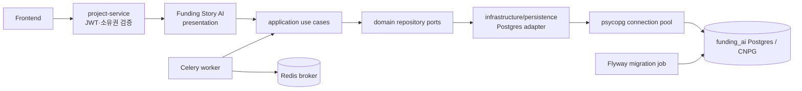

# Funding Story AI DB 연결 구조 정합화 계획

- 상태: 로컬 구현·자동 검증 완료, dev/prod CNPG 검증 대기
- 작성일: 2026-09-17
- 대상 저장소: `Fundit-AI-Funding-Story`
- 기준 문서: [DB 연결 구조](https://app.notion.com/p/07e0c4485f2083adaed28191ef5d815a)
- 기준 문서 최종 확인 시각: 2026-09-17

## 구현 상태 요약

- 2026-09-17 기준 단계 A~D의 저장소 내 구현과 자동 검증을 완료했다.
- 결정 D1은 AI 로컬 DB 포트 `5440`, D2는 Flyway 단일 schema owner, D3는 로컬 Compose migrate/dev·prod K8s Job, D4는 runtime 5/checkpoint 3의 작은 기본 pool로 확정했다.
- Notion 원본 포트 표에 `funding-story-ai: 5440`을 등록했다.
- PostgreSQL 17 Testcontainers에서 신규 migration, 재실행, 기존 schema baseline, repository/API/checkpoint 회귀를 포함한 55개 테스트가 통과했다.
- WP-05 후속 리팩터링까지 완료했다. session/chat/run/export 유스케이스는 framework 비의존 application service로 이동했고, `bootstrap.py`가 repository adapter와 lifecycle을 조립한다. runtime의 compatibility `store.py`는 제거했다.
- WP-07의 설정·배포 순서·connection budget 계약은 문서화했지만 실제 dev CNPG Secret 연결과 BE → AI smoke test는 인프라 환경에서 수행해야 한다.

## 1. 문서 목적과 범위

이 계획은 전달받은 **DB 연결 구조 문서만을 기준**으로 현재 Funding Story AI 서비스의 데이터베이스 연결·운영 방식을 정합화하기 위한 작업을 정의한다.

포함 범위는 다음과 같다.

- 서비스별 로컬 Postgres 격리와 포트 배정
- DB 접속 환경변수와 dev/prod 주입 방식
- 버전 기반 스키마 마이그레이션
- DB 커넥션 풀과 프로세스 생명주기
- 요청에서 DB까지 이어지는 코드 계층 분리
- DB-per-service 경계와 내부 서비스 호출
- Testcontainers 기반 테스트 DB
- CloudNativePG 환경으로 전환하기 위한 실행·검증 기준

다음 항목은 이 계획의 판단 범위가 아니다.

- `ai_records`, `ai_requests`의 비즈니스 테이블 분해·정규화 여부
- AI 입력·출력 JSON 구조와 생성 알고리즘
- FastAPI/OpenAPI 경로 및 응답 계약 변경
- LangGraph 생성 그래프·프롬프트·템플릿 품질
- FE·BE 화면 및 영구 프로젝트 본문 구조

즉, 이 문서는 데이터 모델 재설계안이 아니라 **DB 연결·마이그레이션·격리·테스트 운영 계획**이다.

## 2. 적용 원칙

1. 기준 문서의 Spring 전용 기술인 JPA, Hibernate, HikariCP를 AI 서비스에 그대로 도입하지 않는다.
2. 대신 동일한 책임을 Python/FastAPI 환경에 대응시킨다.
   - Spring Data Repository → Python repository port
   - JPA persistence adapter → psycopg 기반 Postgres adapter
   - HikariCP → `psycopg_pool.ConnectionPool`
   - Flyway 자동 실행 → Flyway migration job 또는 배포 전 migration 단계
3. AI 서비스는 현재의 FastAPI, Celery, LangGraph, Redis 구성을 유지한다.
4. 사용자·프로젝트 소유권은 계속 project-service가 확인하고, AI 서비스는 내부 Bearer 토큰과 `X-Project-Id`로 프로젝트 범위를 제한한다.
5. AI 서비스는 project-service DB를 직접 읽거나 쓰지 않는다.
6. 기존 API 동작과 생성 결과 계약은 DB 정합화 과정에서 바꾸지 않는다.
7. 스키마 변경은 forward-only migration으로 수행하고 이미 적용된 migration 파일을 수정하지 않는다.

## 3. 구현 전 상태와 목표 상태

| 영역 | 현재 상태 | 목표 상태 | 판정 |
|---|---|---|---|
| 서비스별 Compose | AI 저장소에 전용 `compose.yaml` 존재 | AI 전용 Postgres와 AI용 Redis만 포함 | 부분 충족 |
| DB 물리 격리 | AI Postgres 초기화 스크립트가 `funding_be`도 생성 | AI 컨테이너에는 `funding_ai`만 존재 | 수정 필요 |
| 로컬 포트 | `55432` 사용, 기준 포트 표에는 AI 항목 없음 | 충돌 없는 고정 포트를 팀 문서에 공식 등록 | 결정 필요 |
| 접속 설정 | `DATABASE_URL` 단일 값 | `DB_HOST`, `DB_PORT`, `DB_NAME`, `DB_USERNAME`, `DB_PASSWORD` 기반 구성 | 수정 필요 |
| 비밀값 관리 | `.env` 제외, `.env.example` 커밋 | 현재 원칙 유지, 운영 값은 K8s Secret 주입 | 충족/보강 |
| 스키마 관리 | `store.py`의 인라인 DDL과 `PostgresSaver.setup()` | 버전 SQL과 명시적인 migration 단계 | 수정 필요 |
| 커넥션 관리 | DB 작업마다 `psycopg.connect()` | API/worker 프로세스별 connection pool | 수정 필요 |
| 코드 계층 | `api.py`, `tasks.py`, `assets.py`가 `store` 직접 호출 | presentation/application/domain port/infrastructure adapter 분리 | 수정 필요 |
| DB-per-service | 런타임은 AI DB만 사용, 로컬 컨테이너에 BE DB도 생성 | AI·BE 물리 DB와 컨테이너 완전 분리 | 수정 필요 |
| dev/prod 연결 | 환경별 `DATABASE_URL` 주입 가능 | 같은 설정 구조와 K8s Secret으로 CNPG 연결 | 보강 필요 |
| 테스트 DB | 고정 `funding_ai_test` 또는 CI Postgres service | 테스트 실행마다 Testcontainers Postgres 생성·정리 | 수정 필요 |

현재 유지할 수 있는 경계는 다음과 같다.

- `FE → project-service → Funding Story AI` 호출 경로
- project-service의 프로젝트 소유권 확인
- AI 전용 세션·작업·체크포인트 저장
- Redis를 결과 저장소가 아닌 Celery broker로만 사용하는 구조
- 다른 서비스 DB 대신 내부 HTTP API로 데이터를 전달하는 구조

## 4. 목표 연결 구조



핵심 경계는 다음과 같다.

- API와 worker는 동일한 application use case를 사용한다.
- application은 SQL과 psycopg를 직접 알지 않는다.
- 모든 애플리케이션 소유 SQL은 `infrastructure/persistence`에서만 실행한다.
- project-service의 Postgres는 위 구조에 포함되지 않는다.
- migration 실행 권한과 런타임 DML 권한은 운영 환경에서 분리할 수 있어야 한다.

## 5. 선행 결정

구현 시 다음과 같이 결정했다.

### D1. AI 로컬 Postgres 포트

- 결정: 기존 표의 다음 번호인 `5440`.
- `.env.example`, `compose.yaml`, 테스트·개발 문서와 Notion 포트 표를 함께 갱신했다.

### D2. LangGraph 체크포인트 migration 소유권

- 결정: **Flyway를 단일 스키마 변경 주체로 둔다.**
- `langgraph-checkpoint-postgres 3.1.2`의 최종 checkpoint schema와 migration 0~9를 V2로 기준화했다.
- 패키지 내부 migration 목록의 개수·해시가 바뀌면 CI를 실패시키고 새 Flyway migration을 먼저 추가한다.

### D3. migration 실행 위치

- 결정: 로컬에서는 Compose의 일회성 `migrate` 서비스, dev/prod에서는 K8s migration Job으로 실행한다.
- API·worker·beat 각 프로세스가 동시에 migration을 시도하지 않게 한다.
- 배포 전 Flyway validate로 미적용 migration과 checksum 불일치를 차단한다. API/worker 시작 시에는 적용 버전과 실제 schema를 검사하며 불일치 시 기동을 중단한다. readiness도 버전·schema를 확인한다.

### D4. pool 크기

- 로컬 기본값은 runtime min/max `1/5`, checkpoint max `3`, 획득 timeout `10초`로 확정했다.
- 운영값은 API replica 수, Celery worker process 수, CNPG 최대 연결 수를 기준으로 산정해 K8s 환경변수로 주입한다.
- `API 최대 pool × API replica + worker 최대 pool × worker process`가 DB 연결 한도를 넘지 않아야 한다.

## 6. 작업 계획

### WP-01. 버전 기반 스키마 마이그레이션 도입

#### 목표

인라인 `CREATE TABLE IF NOT EXISTS`와 수동 초기화를 제거하고, 새 DB와 기존 DB가 동일한 버전 이력으로 재현되도록 한다.

#### 현재 근거

- `src/funding_story/store.py`가 `ai_records`, `ai_requests` DDL을 문자열로 보유한다.
- `initialize()`가 애플리케이션 DDL과 `PostgresSaver.setup()`을 실행한다.
- README와 개발 문서는 `python -m funding_story.store`를 초기화 명령으로 안내한다.

#### 세부 작업

1. 현재 스키마를 기준화한다.
   - `information_schema`, 인덱스, 제약조건을 덤프한다.
   - `checkpoint_migrations`의 현재 버전과 LangGraph 패키지 버전을 함께 기록한다.
   - 기존 로컬/공유 개발 DB에 데이터가 있다면 row count와 적용 migration 상태를 기록한다.
2. migration 디렉터리를 만든다.
   - 예시: `db/migration/V1__init_ai_records.sql`
   - checkpoint DDL은 결정 D2에 따라 별도 버전으로 분리한다.
   - 각 migration은 한 번 적용 후 수정하지 않는다는 규칙을 README에 명시한다.
3. Flyway 실행 구성을 추가한다.
   - 로컬 Compose에 일회성 `migrate` 서비스를 추가한다.
   - 접속 값은 `.env`의 DB 구성값만 참조한다.
   - migration 실패 시 API/worker를 시작하지 않는다.
4. 기존 DB 전환 경로를 만든다.
   - 테이블과 인덱스가 기준 DDL과 같은지 사전 검사한다.
   - 일치하는 기존 DB만 baseline 처리한다.
   - 불일치하면 자동 수정하지 않고 diff를 출력해 새 migration으로 보정한다.
5. 런타임 DDL을 제거한다.
   - `DDL` 상수와 `initialize()`의 application table 생성을 제거한다.
   - D2가 strict Flyway로 결정되면 `PostgresSaver.setup()`도 런타임/수동 초기화 경로에서 제거한다.
6. 검증 기능을 추가한다.
   - startup/readiness에서 migration 적용 상태 또는 필수 테이블 버전을 확인한다.
   - checksum 불일치와 pending migration을 정상 상태로 숨기지 않는다.
7. 문서를 바꾼다.
   - `python -m funding_story.store` 대신 `migrate` 명령을 안내한다.
   - 신규 설치, 기존 DB baseline, 실패 복구 절차를 분리한다.

#### 산출물

- `db/migration/V*__*.sql`
- Flyway 설정 또는 Compose migration 서비스
- 기존 DB baseline 검사 스크립트
- LangGraph migration 호환성 검사
- 갱신된 개발/배포 문서

#### 검증

- 빈 Postgres에 migration 적용 후 모든 테이블·인덱스·제약조건이 생성된다.
- migration을 두 번 실행해도 두 번째 실행에는 변경이 없다.
- 현재 스키마에서 baseline 후 데이터가 유지된다.
- checksum이 바뀐 기존 migration은 실패한다.
- migration 미적용 상태에서는 readiness가 실패한다.
- API 계약 테스트와 checkpoint 복구 테스트가 그대로 통과한다.

#### 완료 조건

- 애플리케이션 코드에 application table 생성 DDL이 남아 있지 않다.
- 스키마 변경은 새 `V*` 파일 추가로만 수행된다.
- 새 환경과 기존 환경의 전환 절차가 자동 테스트된다.

#### 위험과 대응

- checkpoint DDL을 잘못 기준화하면 실행 재개가 깨질 수 있다.
  - 패키지 버전·migration 목록 해시를 CI에서 고정하고 복구 테스트를 실행한다.
- 기존 DB baseline이 실제 스키마 차이를 숨길 수 있다.
  - baseline 전 구조 비교를 필수로 하고 자동 baseline을 금지한다.
- destructive migration은 SQL down migration으로 되돌리지 않는다.
  - 배포 전 백업과 forward fix를 원칙으로 하고 복구가 필요한 경우 DB restore를 사용한다.

### WP-02. 로컬 DB 물리 격리와 포트 정합화

#### 목표

AI 서비스의 로컬 Postgres 컨테이너가 AI DB만 소유하도록 하고, 고정 포트를 팀 공통 문서에 등록한다.

#### 현재 근거

- `compose.yaml`은 AI Postgres와 Redis를 별도로 실행한다.
- `scripts/postgres/01-local.sql`은 `funding_ai_test`와 `funding_be`까지 같은 컨테이너에 생성한다.
- AI DB 포트 `55432`는 기준 문서의 서비스별 포트 표에 없다.

#### 세부 작업

1. D1에서 AI DB 호스트 포트를 확정한다.
2. Notion의 서비스별 포트 표에 Funding Story AI 행을 추가한다.
3. `compose.yaml`을 AI 서비스 전용으로 정리한다.
   - Postgres에는 `funding_ai`만 생성한다.
   - Redis는 AI worker broker이므로 같은 Compose에 유지한다.
   - project-service DB 초기화 책임을 제거한다.
4. `scripts/postgres/01-local.sql`을 제거하거나 AI DB에 필요한 확장 설치만 남긴다.
5. `funding_ai_test` 생성도 제거하고 WP-06 Testcontainers로 대체한다.
6. 기존 로컬 volume 처리 절차를 문서화한다.
   - 스크립트를 수정해도 기존 volume의 `funding_be`는 자동 삭제되지 않는다.
   - 자동으로 volume을 삭제하지 않는다.
   - 개발자가 데이터를 백업한 뒤 명시적으로 초기화할 수 있는 선택 절차를 제공한다.
7. project-service 로컬 실행은 project-service의 자체 Compose와 `5434` DB를 사용하게 한다.

#### 산출물

- 정리된 `compose.yaml`
- 정리 또는 제거된 `scripts/postgres/01-local.sql`
- 공식 포트 표 갱신
- 기존 volume 전환 안내

#### 검증

- 새 volume에서 `funding_ai` 외 서비스 DB가 생성되지 않는다.
- AI 서비스가 project-service DB 계정 없이 기동하고 테스트된다.
- project-service와 AI service를 동시에 실행해 포트 충돌이 없다.
- Redis 제거/재시작이 Postgres 데이터 소유권에 영향을 주지 않는다.

#### 완료 조건

- AI Compose가 `funding_be`를 만들지 않는다.
- AI DB 포트가 코드 예시와 팀 문서에서 하나의 값으로 일치한다.
- 타 서비스 DB 초기화 명령이 AI 저장소에 남아 있지 않다.

### WP-03. 환경변수와 dev/prod 연결 계약 정리

#### 목표

로컬과 CNPG 환경이 같은 설정 키를 사용하고, 비밀번호가 코드·이미지·설정 파일에 포함되지 않게 한다.

#### 세부 작업

1. `Settings`에 다음 필드를 추가한다.
   - `DB_HOST`
   - `DB_PORT`
   - `DB_NAME`
   - `DB_USERNAME`
   - `DB_PASSWORD`
2. DSN은 문자열 단순 연결 대신 psycopg conninfo 도구로 조립한다.
3. `DATABASE_URL` 호환 정책을 정한다.
   - 권장: 한 배포 주기 동안 override로 지원하고 사용 시 deprecation 로그를 남긴다.
   - 이후 공통 DB 환경변수로 완전히 전환한다.
4. `.env.example`을 공통 키 기반으로 변경한다.
   - 로컬 예시값만 둔다.
   - 운영 비밀값이나 실제 주소를 넣지 않는다.
5. Compose가 같은 `.env` 키를 Postgres 컨테이너와 API/worker에 전달하게 한다.
6. K8s Secret/ConfigMap 매핑 계약을 문서화한다.
   - Secret: 사용자명, 비밀번호, 내부 서비스 토큰
   - 환경별 설정: host, port, DB name, pool 크기
7. 운영 모드에서는 누락값·로컬 기본 비밀번호·localhost DB를 허용하지 않고 기동을 실패시킨다.
8. API, worker, beat, migration job이 동일한 DB 설정 계약을 사용하게 한다.

#### 산출물

- 갱신된 `config.py`, `.env.example`, Compose 환경 설정
- CNPG Secret 키 매핑표
- `DATABASE_URL` 호환 종료 일정

#### 검증

- 로컬 `.env` 구성만으로 API·worker·migration이 같은 DB에 연결된다.
- 비밀번호에 특수문자가 포함되어도 올바른 DSN이 만들어진다.
- 필수값 누락과 placeholder 비밀번호는 운영 모드에서 즉시 실패한다.
- 저장소 추적 파일과 로그에 실제 비밀번호가 나타나지 않는다.

#### 완료 조건

- 로컬과 dev/prod가 동일한 DB 설정 키를 사용한다.
- 운영 배포 파일에는 Secret 값이 없고 환경변수 참조만 존재한다.
- 임시 `DATABASE_URL` 지원을 유지한다면 제거 시점과 책임자가 명시되어 있다.

### WP-04. 프로세스별 DB 커넥션 풀 적용

#### 목표

매 쿼리마다 새 연결을 여는 방식을 제거하고 API와 Celery worker가 제한된 연결 수를 재사용하게 한다.

#### 세부 작업

1. 중앙 DB provider를 만든다.
   - `psycopg_pool.ConnectionPool`
   - `connection()` context manager
   - pool 상태와 종료 함수
2. API lifecycle을 연결한다.
   - FastAPI lifespan에서 pool을 열고 종료 시 닫는다.
   - liveness는 프로세스 상태만, readiness는 `SELECT 1`과 schema 상태를 확인한다.
3. Celery lifecycle을 연결한다.
   - pool은 worker process가 fork된 뒤 초기화한다.
   - 부모 프로세스에서 생성한 연결을 자식이 공유하지 않는다.
   - worker 종료 시 pool을 닫는다.
4. beat와 migration process에는 필요한 최소 연결만 허용한다.
5. 기존 transaction 의미를 유지한다.
   - `with connection()` 성공 시 commit, 예외 시 rollback
   - `FOR UPDATE`, advisory lock, idempotency transaction을 회귀 테스트한다.
6. LangGraph checkpointer 연결도 새 연결 정책과 일치시킨다.
   - 요청마다 별도 unmanaged connection을 열지 않게 한다.
   - checkpoint 작업과 application query의 pool 고갈 가능성을 분리 측정한다.
7. pool 설정을 환경변수로 노출한다.
   - 최소/최대 연결 수
   - 획득 timeout
   - 연결 최대 유휴 시간 또는 수명
8. 대기 시간·pool 고갈·DB 오류를 구조화 로그와 readiness에 반영한다.

#### 산출물

- 공통 DB provider와 lifecycle hook
- pool 설정 키와 운영 산정표
- readiness endpoint
- API/worker 동시성 테스트

#### 검증

- 반복 요청에서 매번 새 물리 연결을 만들지 않는다.
- API 종료와 worker 재시작 후 연결 누수가 없다.
- Celery prefork 환경에서 부모 연결 공유가 없다.
- pool 최대값을 넘는 요청은 설정된 timeout으로 실패하고 무한 대기하지 않는다.
- advisory lock과 rollback 회귀 테스트가 통과한다.

#### 완료 조건

- `psycopg.connect()` 직접 호출이 persistence provider 밖에 없다.
- replica·worker 수를 포함한 최대 연결 수 계산이 배포 문서에 있다.
- DB 장애 시 liveness와 readiness의 역할이 구분된다.

### WP-05. DB 접근 계층 분리 — 완료

#### 목표

HTTP/Celery 코드에서 SQL과 transaction 구현을 제거하고, DB 접근 위치를 `infrastructure/persistence`로 한정한다.

#### 목표 디렉터리 예시

```text
src/funding_story/
  presentation/
    api.py
  application/
    sessions.py
    chats.py
    runs.py
    exports.py
  domain/
    repositories.py
  infrastructure/
    persistence/
      database.py
      records.py
      requests.py
      checkpoints.py
```

프로젝트 규모에 따라 파일 수는 줄일 수 있지만 책임 경계는 유지한다.

#### 세부 작업

1. 현재 `store.py` 호출 지점을 목록화한다.
   - `api.py`
   - `tasks.py`
   - `assets.py`
   - DB를 직접 사용하는 테스트
2. 순수 Python repository port를 정의한다.
   - record 생성·조회·수정·삭제
   - idempotency request 조회·등록
   - checkpoint 정리
   - transaction/unit-of-work 경계
3. 현재 SQL을 Postgres adapter로 감싼다.
   - 첫 단계에서는 SQL과 동작을 바꾸지 않는다.
   - 기존 `store` 함수는 임시 compatibility facade로 유지할 수 있다.
4. endpoint의 유스케이스를 application으로 이동한다.
   - session 시작·메시지 접수·확인
   - run 접수·재시도
   - export 생성·commit·임시 데이터 정리
5. Celery task도 같은 application service를 호출한다.
6. presentation은 인증 헤더 파싱, 요청 검증, HTTP 응답 변환만 담당한다.
7. application/domain 계층에서는 psycopg, SQL 문자열, FastAPI 객체를 import하지 않게 검사한다.
8. 기존 공개 API와 JSON 응답을 snapshot/OpenAPI 비교로 보호한다.

#### 산출물

- repository port
- Postgres persistence adapter
- application use cases
- 얇아진 FastAPI/Celery 진입점
- 계층 의존성 검사

#### 검증

- SQL 문자열이 `infrastructure/persistence` 밖에 남아 있지 않다.
- repository fake를 사용한 application 단위 테스트가 DB 없이 실행된다.
- Postgres adapter 계약 테스트가 Testcontainers에서 실행된다.
- 현재 OpenAPI와 FE 호출 계약 테스트가 변경 없이 통과한다.

#### 완료 조건

- presentation/application/domain이 psycopg를 직접 알지 않는다.
- DB 쿼리를 찾을 때 `infrastructure/persistence`만 확인하면 된다.
- 계층 분리 전후 API 응답과 idempotency·revision 동작이 동일하다.

#### 적용 전략

이 작업은 전면 재작성으로 진행하지 않는다.

1. 기존 `store.py` 뒤에 adapter를 도입한다.
2. 새 repository port로 테스트를 고정한다.
3. endpoint별로 application use case를 하나씩 이동한다.
4. 모든 호출이 이동한 뒤 compatibility facade를 제거한다.

#### 구현 결과 — 2026-09-17

- `application/service.py`가 session 시작·메시지·확인, run 생성·재시도, export·commit과 worker 상태 전이를 담당한다.
- `domain/repositories.py`의 순수 Python port와 `infrastructure/persistence`의 Postgres adapter 사이 의존 방향을 유지한다.
- `bootstrap.py`만 runtime composition root로 infrastructure adapter와 pool lifecycle을 application에 연결한다.
- `api.py`는 인증·HTTP 상태 변환·작업 dispatch, `tasks.py`는 Celery/LangGraph 실행 orchestration만 담당하고 DB 구현을 직접 import하지 않는다.
- compatibility `store.py`를 제거하고 DB 통합 테스트는 Postgres adapter를 명시적으로 사용한다.
- in-memory fake repository로 application 흐름과 idempotency를 Docker/DB 없이 검증한다.
- 계층 회귀 테스트가 application/domain의 FastAPI·Celery·psycopg·infrastructure 의존과 runtime entry point의 adapter 직접 import를 차단한다.
- OpenAPI snapshot, FE 호출 계약, revision/idempotency, worker 복구와 Flyway/Testcontainers 회귀를 포함한 전체 55개 테스트가 통과했다.

### WP-06. Testcontainers 기반 테스트 DB 전환

#### 목표

개발용 Compose DB와 CI 고정 service DB에 의존하지 않고 테스트 실행마다 임시 Postgres를 생성하고 종료 후 정리한다.

#### 현재 근거

- `tests/conftest.py`가 `localhost:55432/funding_ai_test`를 기본값으로 사용한다.
- CI가 PostgreSQL service를 고정 포트로 실행하고 `TEST_DATABASE_URL`을 설정한다.
- 테스트 시작 시 `store.initialize()`가 스키마를 생성한다.

#### 세부 작업

1. dev dependency에 Python Testcontainers Postgres 지원을 추가한다.
2. session-scoped container fixture를 만든다.
   - 저장소에서 확정한 Postgres major version을 사용한다.
   - 임의 호스트 포트를 사용한다.
   - container DSN을 테스트 설정에 주입한다.
3. container 시작 후 실제 Flyway migration을 실행한다.
   - 테스트용 별도 DDL 경로를 만들지 않는다.
   - production과 동일한 migration 파일을 사용한다.
4. 테스트 격리를 적용한다.
   - 테스트별 transaction rollback이 가능한 경우 우선 사용한다.
   - background task/다중 connection 테스트는 관련 테이블을 명시적으로 정리한다.
   - checkpoint와 asset metadata도 함께 정리한다.
5. 고정 `funding_ai_test` 생성 스크립트와 기본 DSN을 제거한다.
6. GitHub Actions의 `services.postgres`와 고정 `DATABASE_URL`을 제거한다.
7. 다음 DB 테스트를 분리한다.
   - 빈 DB migration
   - 기존 baseline/upgrade migration
   - repository adapter 계약
   - API integration
   - idempotency와 advisory lock concurrency
   - checkpoint 재개와 cleanup
8. Docker를 사용할 수 없는 환경에서는 조용히 skip하지 않고 실행 요구사항을 명확히 안내한다.

#### 산출물

- Testcontainers fixture
- migration 기반 DB test bootstrap
- 단순화된 CI workflow
- 테스트 데이터 정리 유틸리티

#### 검증

- 개발용 Compose를 내린 상태에서 `pytest`가 DB 컨테이너를 생성하고 통과한다.
- 테스트 종료 후 컨테이너가 자동 제거된다.
- CI와 로컬이 동일한 bootstrap 경로를 사용한다.
- 테스트 순서를 바꿔도 결과가 동일하다.
- 테스트가 개발/운영 DB 주소를 받으면 안전하게 거부한다.

#### 완료 조건

- 테스트 코드와 CI에 `localhost:고정포트/funding_ai_test` 의존성이 없다.
- DB integration test는 production migration을 사용한다.
- 테스트 실패 시에도 컨테이너 정리와 로그 수집이 수행된다.

### WP-07. CNPG dev/prod 전환과 운영 검증

#### 목표

로컬과 같은 애플리케이션 설정 구조를 유지하면서 dev/prod에서는 CNPG와 K8s Secret을 사용한다.

#### 세부 작업

1. CNPG가 제공할 host, port, database, username, password Secret 키를 확정한다.
2. API, worker, beat, migration job에 동일한 Secret/ConfigMap 참조를 적용한다.
3. migration 전용 계정과 런타임 계정 분리 가능성을 검토한다.
   - migration 계정: DDL 권한
   - runtime 계정: 필요한 DML 권한
4. 배포 순서를 고정한다.
   - DB 백업 또는 복구 지점 확인
   - migration job
   - migration 검증
   - API/worker rollout
   - readiness 확인
   - BE → AI smoke test
5. connection budget을 계산해 CNPG 최대 연결 수에 반영한다.
6. 운영 로그에서 비밀번호·DSN·서명 URL을 마스킹한다.
7. 장애 시 복구 절차를 문서화한다.
   - migration 실패: API rollout 중단
   - DB 연결 실패: readiness 실패, 트래픽 차단
   - schema 불일치: 이전 애플리케이션 이미지로 무조건 롤백하지 않고 schema 호환성을 먼저 확인

#### 검증

- dev CNPG에서 migration과 API/worker 기동이 성공한다.
- Secret 변경만으로 환경을 전환할 수 있다.
- project-service DB 권한 없이 전체 AI 흐름이 동작한다.
- DB 장애·Secret 오류·pending migration 상황에서 readiness가 실패한다.
- 세션 생성 → 대화 → 확인 → 생성 → export → commit smoke test가 통과한다.

#### 완료 조건

- 운영 이미지와 저장소에 실제 DB 비밀번호가 없다.
- migration과 runtime 권한·실행 순서가 명확하다.
- CNPG 환경에서 BE → AI 통합 검증 증거가 남아 있다.

## 7. 구현 순서와 의존성

```text
D1~D4 결정
  → WP-01 migration
  → WP-02 DB 격리·포트
  → WP-03 환경변수 계약
  → WP-04 connection pool
  → WP-05 persistence 계층
  → WP-06 Testcontainers·CI
  → WP-07 CNPG dev/prod 검증
```

실행 단계는 다음처럼 나눈다.

### 단계 A — 기준과 안전망

- D1~D4 결정
- 현재 DB schema inventory와 백업 기준 확보
- Flyway migration과 기존 DB baseline 경로 구현
- 빈 DB/기존 DB migration 테스트

### 단계 B — 로컬 연결 정합화

- AI Compose에서 BE/test DB 생성 제거
- 포트·환경변수 통일
- API/worker/migration 공통 설정 적용

### 단계 C — 런타임 구조

- connection pool과 lifecycle 도입
- repository port와 Postgres adapter 도입
- application use case 단계적 이동

### 단계 D — 테스트와 CI

- Testcontainers 전환
- CI Postgres service 제거
- migration·pool·adapter·복구 회귀 테스트

### 단계 E — dev/prod 전환

- CNPG Secret 연결
- migration job과 readiness 연결
- BE → AI 통합 smoke test
- 운영 연결 수와 장애 복구 검증

## 8. 전체 완료 기준

- [x] AI 서비스 포트가 팀 포트 표에 등록되어 있다.
- [x] AI Compose가 다른 서비스 DB와 고정 테스트 DB를 생성하지 않는다.
- [x] DB 접속은 공통 `DB_*` 환경변수로 구성된다.
- [x] 실제 비밀번호는 `.env`, K8s Secret 외 추적 파일에 없다.
- [x] 모든 application/checkpoint schema 변경이 승인된 버전 migration 경로를 사용한다.
- [x] 런타임 코드가 테이블을 생성하거나 변경하지 않는다.
- [x] API와 worker가 프로세스별 connection pool을 사용한다.
- [x] 런타임 DML SQL이 `infrastructure/persistence`에 한정된다.
- [x] API·Celery 진입점이 application use case를 사용하고 runtime composition은 `bootstrap.py`에 한정된다.
- [x] application/domain 계층이 FastAPI·Celery·psycopg·infrastructure에 의존하지 않는다.
- [x] repository fake 기반 application 테스트가 Docker/DB 없이 실행된다.
- [x] AI 서비스는 project-service DB 계정·테이블에 접근하지 않는다.
- [x] pytest가 Testcontainers Postgres를 자동 생성·정리한다.
- [x] CI와 로컬 테스트가 같은 migration/bootstrap 경로를 사용한다.
- [ ] dev CNPG에서 migration과 BE → AI smoke test가 통과한다.
- [x] 기존 OpenAPI, idempotency, revision, checkpoint 복구 계약이 유지된다.

## 9. 예상 변경 파일

새 경로의 정확한 이름은 구현 시 확정하지만 최소 변경 범위는 다음과 같다.

```text
.env.example
compose.yaml
pyproject.toml
uv.lock
.github/workflows/test.yml
db/migration/V*__*.sql
src/funding_story/config.py
src/funding_story/api.py
src/funding_story/tasks.py
src/funding_story/assets.py
src/funding_story/application/**
src/funding_story/bootstrap.py
src/funding_story/domain/**
src/funding_story/infrastructure/persistence/**
tests/conftest.py
tests/test_*migration*.py
tests/test_*persistence*.py
tests/test_application.py
tests/test_architecture.py
docs/development.md
docs/architecture.md
docs/team-handoff.md
README.md
```

현재 별도 템플릿 작업에서 수정 중인 파일과 겹치는 변경은 독립 커밋으로 분리하고, DB 정합화 작업에서 템플릿·생성 로직을 함께 정리하지 않는다.

## 10. 검증 매트릭스

| 시나리오 | 기대 결과 | 단계 |
|---|---|---|
| 빈 DB 최초 설치 | 모든 migration 적용, API/worker 정상 기동 | A |
| 기존 DB baseline | 데이터 보존, schema history 생성 | A |
| 적용된 migration 파일 변조 | checksum 오류로 실패 | A |
| AI·project-service 동시 로컬 실행 | 포트 충돌 없음, 각자 DB만 사용 | B |
| 비밀번호 특수문자 | 안전한 DSN 생성과 연결 성공 | B |
| DB 필수 환경변수 누락 | 운영 기동 실패 | B |
| API 동시 요청 | pool 최대치 내 처리, 누수 없음 | C |
| worker process 재시작 | fork 전 연결 공유 없음 | C |
| revision/idempotency 충돌 | 기존 409 동작 유지 | C/D |
| checkpoint 재개 | 중단된 생성 상태 복구 | D |
| Compose DB 없이 pytest | Testcontainers로 전체 DB 테스트 실행 | D |
| 테스트 종료/실패 | 임시 Postgres 자동 정리 | D |
| dev CNPG Secret 오류 | readiness 실패, 트래픽 차단 | E |
| BE → AI 전체 흐름 | 기존 API 계약으로 export/commit 성공 | E |

## 11. 남은 외부 결정

1. dev/prod CNPG의 최대 연결 수와 API/worker replica 수
2. migration DDL 계정과 runtime DML 계정 분리 여부
3. Postgres 17을 운영에서도 유지할지 여부
4. 기존 공유 개발 DB에서 보존할 AI session·생성 데이터와 baseline 적용 대상

포트, schema owner, migration 실행 위치는 구현 결정으로 닫았다. 위 항목은 실제 인프라 값과 데이터 보존 책임자가 필요하므로 저장소 코드만으로 확정하지 않는다.

## 12. 출처와 현재 구현 근거

### 기준 문서

- [DB 연결 구조](https://app.notion.com/p/07e0c4485f2083adaed28191ef5d815a) — 로컬 컨테이너, DB 환경변수, Flyway, 계층 구조, DB-per-service, CNPG, Testcontainers 기준

### 구현 증거

- `compose.yaml`, `.env.example`, `src/funding_story/config.py` — AI 전용 `5440`, 공통 `DB_*`, pool 설정
- `db/migration/V1__init_ai_records.sql`, `V2__init_langgraph_checkpoints.sql` — Flyway 단일 schema 이력
- `scripts/baseline_existing_db.py`, `scripts/check_langgraph_migrations.py` — 기존 DB 전환과 vendor schema drift 방지
- `src/funding_story/infrastructure/persistence` — pool과 Postgres adapter
- `src/funding_story/domain/repositories.py` — 순수 repository port
- `src/funding_story/application/service.py`, `src/funding_story/bootstrap.py` — framework 비의존 유스케이스와 runtime composition root
- `tests/test_application.py`, `tests/test_architecture.py` — DB 없는 application 단위 테스트와 계층 의존성 회귀 검사
- `tests/conftest.py`, `tests/test_database*.py`, `.github/workflows/test.yml` — Testcontainers/Flyway 기반 로컬·CI 공통 bootstrap
- `docs/development.md`, `docs/architecture.md`, `docs/validation.md` — 실행·배포·검증 계약
