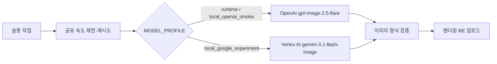

# `gpt-image-2.5-flare` Provider 전환 계획

## 현재 결정 사항

| 항목 | 결정 |
|---|---|
| 운영 이미지 Provider | OpenAI |
| 운영 모델 | `gpt-image-2.5-flare` |
| 개발·비교 실험 Provider | Google Vertex AI 유지 |
| 환경 선택 | `MODEL_PROFILE`로 운영·OpenAI smoke·Google 실험 조합 고정 |
| 텍스트 모델 | 기존 Gemini 유지 |
| OpenAI 호출 방식 | 공식 Python SDK + Images API 직접 호출 |
| OpenAI 운영 인증 | EKS projected ServiceAccount token 기반 Workload Identity Federation; API key 미배포 |
| 참조 이미지 없음 | `images.generate` |
| 참조 이미지 있음 | `images.edit` |
| 참조 이미지 | `images.edit` 기본 처리 (`input_fidelity` 미전달) |
| 참조 이미지 상한 | 슬롯별 최대 16개; 리워드 슬롯은 해당 리워드 → 공통 → 기타 순 |
| 출력 품질 | `medium` |
| 출력 크기 | 가로 `1536x1024` · 세로 `1024x1536` · 정방형 `1024x1024` |
| Provider 자동 전환 | 사용하지 않음 |
| LangChain | 도입하지 않음 |
| 완료 시간 | 5분은 성능 목표; 강제 성공·중단 기준으로 사용하지 않음 |
| 결과 판정 | 모든 필수 텍스트·이미지 슬롯 생성 시 `succeeded` |
| 부분 성공 판정 | 사용 가능한 결과와 미생성 슬롯이 함께 있으면 `partially_succeeded` |
| 실패 판정 | 사용 가능한 결과가 없으면 `failed` |
| 저장 정책 | 기존과 동일: AI가 원본·중간 이미지·체크포인트를 영구 저장하지 않음 |

## 구성

## 구현 계획

| 순서 | 변경 | 완료 조건 |
|---:|---|---|
| 1 | Provider·모델·품질·OpenAI WIF 인증 설정 추가 | 환경변수 검증 통과 |
| 2 | OpenAI Images API 어댑터 추가 | 생성·참조 편집 응답을 동일한 `(bytes, mime)` 계약으로 반환 |
| 3 | 슬롯 비율별 출력 크기 연결 | 각 이미지 작업에 표준 출력 크기 전달 |
| 4 | OpenAI 오류·요청 ID·재시도 힌트 연결 | 429/5xx가 기존 공유 재시도 정책에 반영 |
| 5 | Gemini 경로 회귀 방지 | Provider 설정만으로 두 경로 선택 가능 |
| 6 | 단위·통합 계약 검증 | 테스트·정적 검사 통과 |

## 경계

| 포함 | 제외 |
|---|---|
| 이미지 Provider 선택·호출·응답 검증 | 텍스트 모델 교체 |
| OpenAI WIF·local smoke API key 호환 설정 | BE/FE DTO 변경 |
| OpenAI 429/5xx 재시도 연동 | Provider 간 자동 fallback |
| 기존 병렬 슬롯 생성과 연결 | LangChain 도입 |
| Gemini 비교 경로 유지 | DB·ERD 추가 |

## 검증 기준

| 검증 | 기준 |
|---|---|
| API 분기 | 참조 없음=`generate`, 참조 있음=`edit` |
| 모델 선택 | 운영 설정에서 공식 undated alias `gpt-image-2.5-flare` 사용 |
| 데이터 | 유효한 PNG/JPEG/WebP만 후속 단계로 전달 |
| 재시도 | SDK 내부 재시도 없이 작업 스케줄러가 단일 소유 |
| 보안 | dev/prod API key 미사용, identity token·오류 본문·사용자 prompt 미로그 |
| 회귀 | 기존 Gemini·본문 HTML·렌더링 테스트 유지 |

## 구현 결과

| 항목 | 결과 |
|---|---|
| OpenAI SDK·잠금 파일 | 완료 |
| Provider 분기·생성·편집 | 완료 |
| 크기·참조 선택·응답 검증 | 완료 |
| 429/5xx·통신 오류 재시도 연결 | 완료 |
| 전체 자동 테스트 | 검증 명령으로 확인 |
| 정적 검사·패키지 빌드 | 통과 |
| OpenAI 로컬 실 API 전체 생성 | 완료 — 12개 블록·이미지 18개·PNG 12개·하단 HTML, 137.129초 |
| OpenAI dev EKS WIF smoke | 미실행 — 외부 매핑·dev EKS 배포 후 수행 |

## WIF 외부 설정

| 위치 | 설정 |
|---|---|
| EKS | Funding Story AI 전용 Kubernetes ServiceAccount와 audience `https://api.openai.com/v1` projected token 구성 |
| OpenAI Platform | EKS cluster OIDC issuer와 audience `https://api.openai.com/v1`로 Workload Identity Provider 생성 |
| OpenAI Platform | `system:serviceaccount:<namespace>:<service-account>` `sub`를 OpenAI project service account에 매핑 |
| OpenAI 권한 | 매핑 대상에 최소 `api.model.request` 권한 부여 |
| Runtime | OpenAI 발급 ID·audience와 projected token 경로를 환경변수로 주입 |

audience는 OpenAI 설정과 projected token 값이 정확히 같아야 한다. 로컬 실호출은 `api_key` 호환 모드를 사용하고, 운영 WIF 실검증은 dev EKS Pod에서 수행한다. 기본 자동 테스트는 token file·OpenAI 응답을 모의하여 비용을 발생시키지 않는다. 상세 배포 계약은 [EKS Provider 인증](aws-eks-provider-auth.md)에 둔다.
