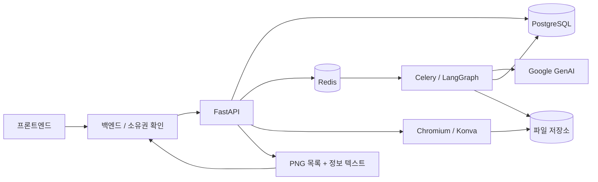

<p align="center">
  
</p>

<p align="center">
  <a href="https://www.python.org/"></a>
  <a href="https://docs.astral.sh/uv/"></a>
  <a href="https://fastapi.tiangolo.com/"></a>
  <a href="https://github.com/langchain-ai/langgraph"></a>
</p>
<p align="center"><a href="../README.md">English</a> | 한국어</p>
<p align="center">제품 정보와 대화로 핵심 강점을 정리하고,<br>펀딩 상세페이지 이미지와 정보 텍스트를 생성합니다.</p>

---

Funding Story AI는 Fundit의 내부 AI API입니다. 등록된 제품 정보와 사용자 대화를 바탕으로 추가 정보를 수집하고 요약·핵심 강점을 확인받습니다. 비동기 작업이 디자인 템플릿에 문구와 이미지를 채우며, 최종 결과는 순서가 있는 PNG 자산과 프로젝트 정보 텍스트입니다.

이 저장소는 AI API·워커·템플릿·테스트·호출 계약을 포함합니다. FE 화면, BE 프로젝트 권한·영구 본문 저장·게시는 각 팀의 서비스가 담당합니다.

## 주요 기능

### 대화형 정보 수집

- 등록 정보·선물·참고 이미지를 읽고 부족한 맥락만 질문합니다.
- 답변은 SSE로 전달하며 강점 수정·정렬·삭제는 채팅으로 처리합니다.
- 최신 입력 revision을 사용자가 확인해야 생성할 수 있습니다.
- 가격·단위·스펙·조건은 입력을 보존하며 누락된 사실을 추정하지 않습니다.

### 디자인 템플릿 기반 생성

- 생활가전 템플릿의 필수 9개 블록을 정해진 순서로 포함합니다.
- 확인한 강점별 Point와 추가 제품 안내가 필요한 경우 Information을 구성합니다.
- 이미지 슬롯마다 생성하며 실패한 슬롯만 재시도할 수 있습니다.
- Konva로 텍스트 슬롯의 폭·높이·줄 수를 측정하고 형식 오류는 기존 LangGraph 재시도로 전달합니다.
- 사실·표현을 재판정하는 추가 모델 호출이나 자동 사실 교정은 없습니다.

### PNG와 텍스트 반환

- Chromium + Konva + Pretendard로 블록 PNG를 출력합니다.
- 글꼴 크기는 유지하고 연결 문구는 템플릿의 배치 규칙을 따릅니다.
- 예산·일정·팀·정책·예상 어려움은 일반 텍스트로 반환합니다. 선물 상세 설명은 제외합니다.
- BE 저장 확인 후 임시 디자인을 정리합니다. 저장된 PNG의 디자인 재편집 기능은 제공하지 않습니다.

## 🚀 빠른 시작

Python 3.12.14, uv, Docker Compose가 필요합니다. 실제 모델 호출에는 Google Cloud ADC와 모델 접근 권한이 필요하며 비용이 발생합니다. 저장소 루트에서 실행합니다.

```bash
uv sync --frozen
cp .env.example .env
uv run playwright install chromium
uv run python scripts/install_font.py
```

Linux에서는 `uv run playwright install --with-deps chromium`을 사용합니다. `.env`의 `GOOGLE_CLOUD_PROJECT`, `AI_SERVICE_TOKEN`을 설정합니다. ADC가 없다면 `gcloud auth application-default login`을 실행합니다.

```bash
docker compose up -d
uv run python -m funding_story.store
```

다음 명령은 각각 별도 터미널에서 실행합니다.

```bash
uv run uvicorn funding_story.api:app --host 127.0.0.1 --port 58001
uv run celery -A funding_story.tasks worker --pool=solo --loglevel=INFO
uv run celery -A funding_story.tasks beat --loglevel=INFO --schedule=data/celerybeat-schedule
```

`solo`는 macOS 개발 환경 설정입니다. API·워커는 동일한 DB·자산 저장소·설정을 사용합니다. [개발 환경 안내](../docs/development.md)와 [환경변수 예시](../.env.example)를 참고하세요.

## 🏗 호출 구조



Python 3.12 / uv / FastAPI / LangGraph / Celery / PostgreSQL / Redis / Google GenAI 공식 SDK / 선택적 LangSmith 추적을 사용합니다. 의존성 버전은 `uv.lock`으로 고정합니다.

**FE → BE → AI** 경로로 호출합니다. BE가 소유권을 확인한 후 내부 Bearer 토큰과 `X-Project-Id`를 전달합니다. 브라우저에 AI 내부 토큰을 노출하지 않습니다.

업로드 → 세션·대화 → 요약 확인 → 생성·조회·재시도 → PNG export → BE 저장 → commit 순서입니다. [API 계약](../docs/architecture.md)과 [OpenAPI](../docs/openapi.json)에 상세 필드가 있습니다.

## 반환 결과

- 블록별 PNG 자산 ID·순서·크기·대체 텍스트
- 프로젝트 정보 텍스트와 공통 안내 key
- 후속 AI용 `project_summary.summary`와 `storyline`
- BE 저장 확인용 export ID·원본 revision

[반환 예시](../docs/examples/export-result.json)를 참고하세요. 3종 선물 디자인에서 미등록 카드는 입력 대기로 유지하며 선물·가격을 지어내지 않습니다.

## 검증 범위

```bash
uv run ruff check src tests scripts
uv run pytest -q
uv build
```

테스트는 별도 PostgreSQL DB와 모의 모델 호출을 사용하고 렌더링에는 실제 Chromium을 사용합니다. 테스트 자료는 [가상 제품 입력](../tests/fixtures/appliance.json)과 [참고 이미지](../tests/fixtures/original.png)입니다.

로컬 자동 테스트 37개와 실제 14블록 생성·출력을 확인했습니다. 생성 이미지의 제품 세부 형상 차이는 남습니다. GitHub CI도 통과했습니다. 운영 배포·타팀 게시 연동 완료를 의미하지 않습니다.

## 관련 문서

- [개발·환경설정](../docs/development.md)
- [실행·API 계약](../docs/architecture.md)
- [프론트 호출 대응](../docs/frontend-call-contract.md)
- [팀별 인계](../docs/team-handoff.md)
- [검증 범위](../docs/validation.md)
- [외부 라이브러리 고지](../THIRD_PARTY_NOTICES.md)
