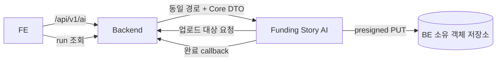

<p align="center">
  
</p>

<p align="center">
  <a href="https://www.python.org/"></a>
  <a href="https://docs.astral.sh/uv/"></a>
  <a href="https://fastapi.tiangolo.com/"></a>
  <a href="https://github.com/langchain-ai/langgraph"></a>
</p>
<p align="center"><a href="../README.md">English</a> | 한국어</p>

# Fundit Funding Story AI

대화형 정보 수집과 펀딩 상세 페이지 전체 생성을 담당하는 내부 AI 서비스입니다.
호출 경계는 **FE → BE → AI**이며, FE는 AI를 직접 호출하지 않고 AI는 BE Core DB를
직접 읽거나 쓰지 않습니다.

## Funding Story 기능

### 대화형 정보 수집

- 등록된 프로젝트 사실·리워드·참고 이미지를 바탕으로 시작합니다.
- 부족한 Story 맥락을 SSE 질문·요약으로 수집합니다.
- 채팅으로 강점을 수정·정렬·제외할 수 있습니다.
- 최신 revision을 확인해야 전체 생성할 수 있습니다.
- 입력된 가격·단위·스펙·조건을 보존하고 없는 사실은 만들지 않습니다.

### 템플릿 생성

- 설정된 Funding Story 템플릿 블록에 문구와 이미지를 생성합니다.
- 확인된 강점과 선택 제품 정보를 사용하며 근거 없는 내용을 추가하지 않습니다.
- 이미지·렌더링 슬롯은 내부적으로 재시도하고, 필요한 경우 사용 가능한 부분 결과를 전달합니다.

### 렌더링·전달

- 서버 Chromium·Konva·Pretendard로 PNG를 렌더링합니다.
- 단기 업로드 대상으로 생성 이미지를 BE 소유 저장소에 업로드합니다.
- 생성 본문·이미지 참조·종료 상태를 하나의 완료 callback으로 BE에 전달합니다.

## 계약 요약

| 경계 | 계약 |
|---|---|
| BE → AI | `Authorization: Bearer <service-token>` + `X-Project-Id` |
| 공개 서비스 base path | `/api/v1/ai` — FE→BE와 BE→AI가 같은 경로 사용 |
| AI → BE | `X-Internal-Api-Key` + `X-Project-Id` |
| 최종 이미지 | BE가 발급한 presigned PUT으로 BE 소유 객체 저장소에 업로드 |
| 최종 결과 | AI 완료 callback 후 BE가 검증·저장·공개 |
| 재생성 | 전체 재생성만 지원, 블록·슬롯 부분 재생성 제외 |

Funding Story API:

| Method | Path | 기능 |
|---|---|---|
| `POST` | `/api/v1/ai/sessions` | BE Core 사실로 TTL 정보 수집 세션 생성 |
| `GET` | `/api/v1/ai/sessions/latest` | 최근 유효 세션 복구 |
| `GET` | `/api/v1/ai/sessions/{session_id}` | 공개 세션 상태 조회 |
| `POST` | `/api/v1/ai/sessions/{session_id}/start` | AI 첫 질문 접수 |
| `POST` | `/api/v1/ai/sessions/{session_id}/messages` | 멱등 메시지 접수 |
| `GET` | `/api/v1/ai/chats/{chat_id}/events` | 답변·종료 SSE |
| `POST` | `/api/v1/ai/sessions/{session_id}/confirm` | 현재 요약 revision 확인 |
| `POST` | `/api/v1/ai/runs` | 전체 생성 접수 |

생성 후 AI가 호출하는 BE 내부 API:

| Method | Path | 기능 |
|---|---|---|
| `POST` | `/internal/ai/media/upload-targets` | 결과 슬롯별 presigned PUT 대상 발급 |
| `POST` | `/internal/ai/runs/{run_id}/completion` | 성공·부분 성공·실패 완료 통지 |

AI 결과 조회, asset, export, export commit, 부분 재생성 API는 없습니다. FE 공개 run 조회와
최종 결과 소유는 BE 책임입니다.

## 데이터 소유·수명



- 세션·채팅·run 제어 상태·revision·멱등 정보는 TTL Redis에만 둡니다.
- 프로젝트 사실·원본 이미지·최종 PNG·공개 본문·최종 run 상태는 BE가 소유합니다.
- 원본·중간 생성·렌더링 이미지는 작업 중 AI 프로세스 메모리에서만 사용합니다.
- Funding Story 입력 snapshot, 생성 문서, 중간 이미지, LangGraph checkpoint는 PostgreSQL에
  저장하지 않습니다.
- PostgreSQL은 별도 기능인 Content Insights에만 유지합니다.
- 로그·trace에는 사용자 원문, Core DTO, 프롬프트, 생성 본문, 이미지 참조, 서명 URL을
  남기지 않습니다.

## 생성 규칙

- 프로젝트·리워드·가격·수량·원본 이미지는 BE Core DTO만 사실 근거로 사용합니다.
- 리워드 가격은 `price`만 표시하며 `normal_price`·할인 표현은 사용하지 않습니다.
- `quantity`는 재고 수량이며 이미지 속 완제품 개수로 사용하지 않습니다.
- 필수 정보를 만족하면 채팅에서 제품·이야기·강점을 요약하고 확인받습니다.
- 이미지 생성은 내부 재시도하며, 일부 최종 실패에도 사용 가능한 결과가 있으면
  `partially_succeeded`, 없으면 `failed`로 완료 통지합니다.

## Content Insights

Content Insights는 선택적인 Funding Story 작성 흐름과 분리된 기능입니다. 프로젝트 저장 후
Project Service가 정규 snapshot을 기준으로 다음 두 결과를 비동기로 요청합니다.

- `PAGE_SUMMARY`: 프로젝트 상세 페이지용 짧은 요약
- `STORYLINE`: 프로젝트가 무엇인지와 왜 필요한지를 요약한 두 개의 순서 있는 제목·설명 블록(schema v2, 내부 의미 구분명은 노출하지 않음)

두 artifact 모두 프로젝트 준비 상태 판단에 필요한 결과입니다. 최종 공개 결과는 Project
Service가 소유하고 FE는 Project Service를 통해 조회하며, FE가 AI endpoint를 직접 호출하지
않습니다. 현재 내부 endpoint도 같은 service base path를 사용합니다.

| Method | Path | 기능 |
|---|---|---|
| `POST` | `/api/v1/ai/content-insight-runs` | snapshot 기반 parent run 생성 |
| `GET` | `/api/v1/ai/content-insight-runs/{run_id}` | artifact 상태·결과 조회 |
| `POST` | `/api/v1/ai/content-insight-runs/{run_id}/artifacts/{artifact_type}/retry` | 재시도 가능한 artifact 단건 재시도 |

Content Insights는 자체 PostgreSQL artifact 상태·queue·revision 확인·재시도 생명주기를
사용하며 Funding Story의 TTL 세션 상태와 분리됩니다.

## 로컬 실행

Python 3.12.14, [uv](https://docs.astral.sh/uv/), Docker가 필요합니다. 실제 모델 호출에는
Google Cloud 인증이 필요합니다.

```bash
uv sync --frozen
cp .env.example .env
uv run playwright install chromium
uv run python scripts/install_font.py
docker compose up -d
docker compose run --rm migrate validate
```

API·worker·scheduler를 각각 실행합니다.

```bash
uv run uvicorn funding_story.api:app --host 127.0.0.1 --port 58001
uv run celery -A funding_story.tasks worker --pool=solo --loglevel=INFO
uv run celery -A funding_story.tasks beat --loglevel=INFO --schedule=data/celerybeat-schedule
```

## 검증

```bash
uv run ruff check src tests scripts
uv run pytest -q
uv build
```

Funding Story application·HTTP 계약 테스트는 in-memory TTL adapter를 사용합니다. DB 테스트는
Content Insights와 기존 migration 검증을 위해 격리된 PostgreSQL 17을 사용하고, 렌더링 테스트는
실제 Chromium·Pretendard를 사용합니다.

## 문서

- [API·실행 계약](../docs/architecture.md)
- [OpenAPI](../docs/openapi.json)
- [개발·환경 설정](../docs/development.md)
- [Content Insights API 설계](../docs/content-insights-api-design.md)
- [Content Insights 통합](../docs/content-insights-integration-interface.md)
- [Content Insights 운영](../docs/content-insights-operations.md)
- [Content Insights 작업 체크리스트](../docs/content-insights-implementation-checklist.md)
- [프론트 호출 계약](../docs/frontend-call-contract.md)
- [팀별 인계](../docs/team-handoff.md)
- [검증 범위](../docs/validation.md)
